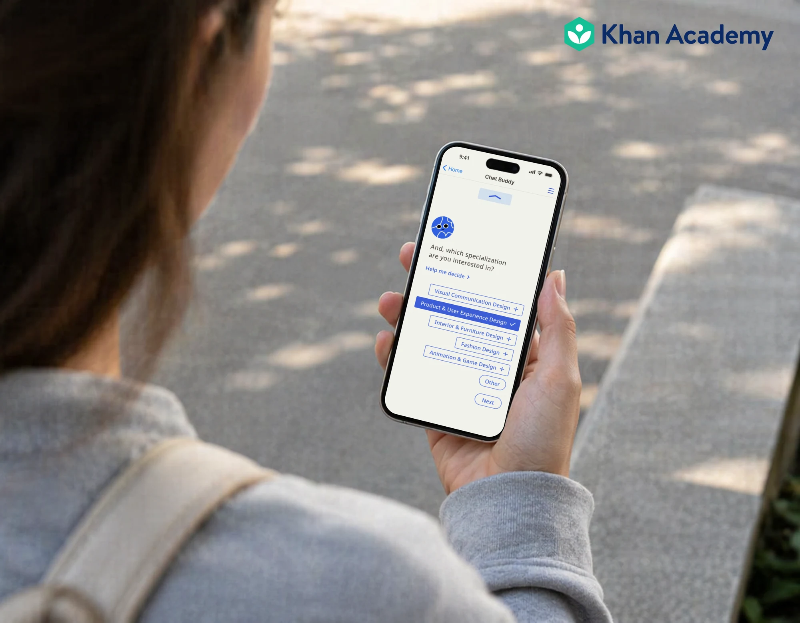
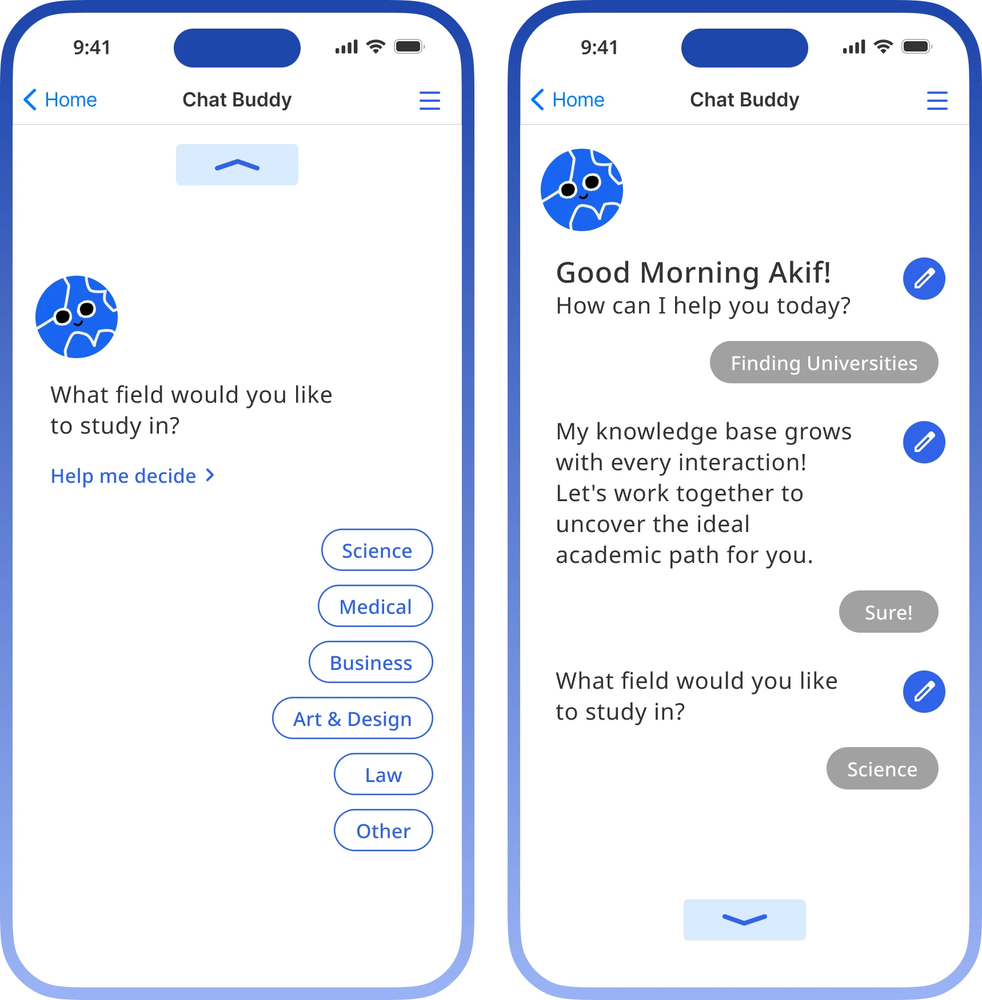
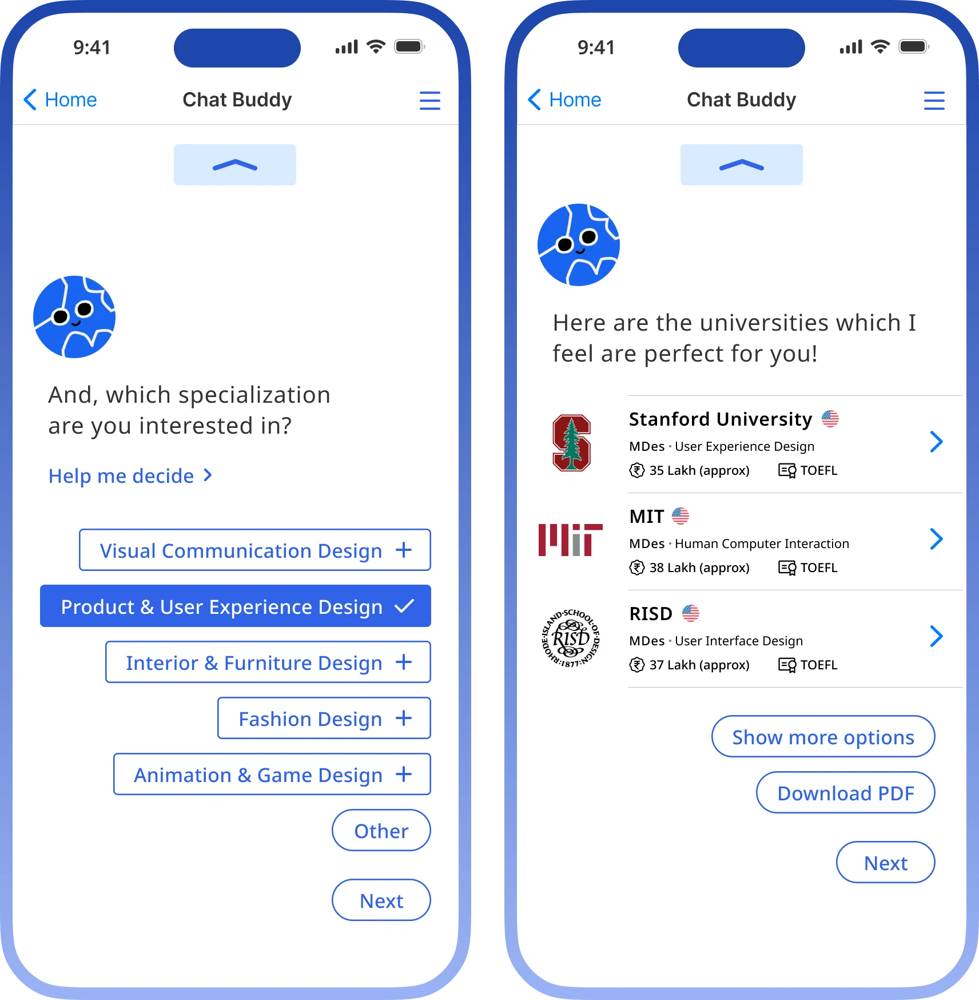

Rule-based chatbots follow predefined flows and decision logic, while generative AI chatbots create responses dynamically based on learned patterns and context.

Rule-based systems require more upfront structuring but offer higher reliability and consistency. Meanwhile, generative systems are more flexible and scalable, but can produce incorrect or unpredictable outputs if not properly constrained.

Since choosing the right course and university plays a pivotal role in a persons life, its a fairly high stakes decision. To avoid any chance of misinformation its better to go with rule based chatbots for core decision logic. Gen AI can however help in secondary explanations.

Khan Academy’s deep expertise in test preparation enables it to recommend resources tailored to each student’s needs.

Leveraging its credibility and network, it can build a reliable database of universities, including peer reviews and insights.

It can also provide structured, up-to-date guidance on admission processes for leading universities.

### Try out the prototype for yourself

[Open Figma prototype](https://www.figma.com/proto/vexbqUMeX1ImAyWjjAkydr/Chatbot-Interface?node-id=213-1739&viewport=1400%2C109%2C0.21&t=XoFKIphGCDCrJZ9c-1&scaling=scale-down&content-scaling=fixed&starting-point-node-id=213%3A1739&page-id=113%3A1699)
