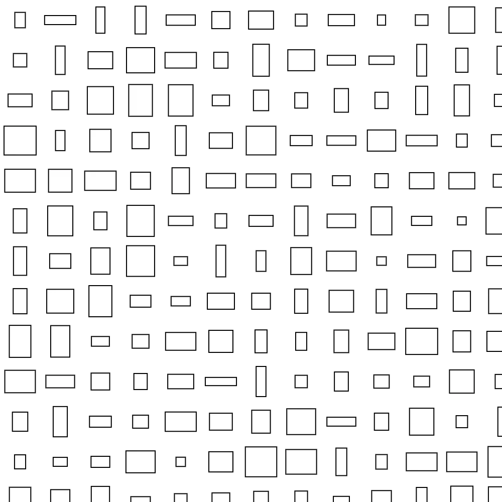

You import the below code into p5.js and press ‘p’ to export a zip file with png frames. Then just convert those frames to GIF, I recommend FFmpeg via terminal.

::: toggle Show code for Cosmos

```html
<!DOCTYPE html>
<html lang="en">
<head>
  <meta charset="UTF-8" />
  <meta name="viewport" content="width=device-width, initial-scale=1.0" />
  <title>Twinkling Stars Clean Export</title>
  <script src="https://cdn.jsdelivr.net/npm/p5@1.9.4/lib/p5.min.js"></script>
  <script src="https://cdn.jsdelivr.net/npm/jszip@3.10.1/dist/jszip.min.js"></script>
  <style>
    html, body {
      margin: 0;
      padding: 0;
      background: #111;
      font-family: Arial, sans-serif;
      color: #ddd;
    }
    canvas {
      display: block;
      margin: 20px auto 12px;
      box-shadow: 0 8px 30px rgba(0,0,0,0.35);
    }
    .wrap {
      width: min(2000px, calc(100vw - 32px));
      margin: 0 auto 24px;
    }
    .controls {
      display: flex;
      gap: 12px;
      align-items: center;
      flex-wrap: wrap;
      margin-bottom: 10px;
    }
    button {
      background: #222;
      color: #eee;
      border: 1px solid #444;
      border-radius: 8px;
      padding: 10px 14px;
      cursor: pointer;
      font-size: 14px;
    }
    button:hover {
      background: #2d2d2d;
    }
    #status {
      font-size: 14px;
      color: #cfcfcf;
      min-height: 20px;
    }
  </style>
</head>
<body>
<div class="wrap">
  <div class="controls">
    <button id="exportBtn">Export PNG ZIP</button>
    <span>Press <b>P</b> as shortcut too.</span>
  </div>
  <div id="status">Ready.</div>
</div>

<script>
const W = 2000;
const H = 900;
const FPS = 30;
const LOOP_SECONDS = 6;
const TOTAL_FRAMES = FPS * LOOP_SECONDS;
const ZIP_NAME = 'twinkling-stars-frames.zip';

let stars = [];
let cnv;
let noiseLayer;

let exportMode = 'preview';
let exportFrame = 0;
let zip = null;
let folder = null;
let processing = false;
let statusEl;

class Star {
  constructor() {
    this.x = random(W);
    this.y = pow(random(), 1.8) * H;
    this.size = random(1, 3);
    this.phase = random(TWO_PI);
    this.freq = random([1, 2, 3]);
    this.glow = random(2.5, 4.5);
  }

  draw(t) {
    const twinkle = 0.5 + 0.5 * sin(TWO_PI * t * this.freq + this.phase);
    const alpha = lerp(80, 255, twinkle);
    const glowSize = this.size * this.glow * (0.9 + 0.5 * twinkle);

    noStroke();
    fill(255, alpha * 0.18);
    circle(this.x, this.y, glowSize);

    fill(255, alpha);
    circle(this.x, this.y, this.size * (0.95 + 0.5 * twinkle));
  }
}

function setStatus(msg) {
  if (statusEl) statusEl.textContent = msg;
  console.log(msg);
}

function setup() {
  statusEl = document.getElementById('status');
  document.getElementById('exportBtn').addEventListener('click', startExport);

  cnv = createCanvas(W, H);
  cnv.parent(document.body);
  frameRate(FPS);
  pixelDensity(1);

  for (let i = 0; i < 400; i++) {
    stars.push(new Star());
  }

  noiseLayer = createGraphics(W, H);
  noiseLayer.clear();
  noiseLayer.noStroke();
  for (let i = 0; i < 10000; i++) {
    noiseLayer.fill(255, random(5, 10));
    noiseLayer.rect(random(W), random(H), 1, 1);
  }

  setStatus('Ready. Click "Export PNG ZIP" or press P.');
}

function renderFrame(f) {
  background(0);
  const t = f / TOTAL_FRAMES;

  for (const s of stars) {
    s.draw(t);
  }

  image(noiseLayer, 0, 0);
}

function draw() {
  if (exportMode === 'preview') {
    renderFrame((frameCount - 1 + TOTAL_FRAMES) % TOTAL_FRAMES);
    return;
  }

  if (exportMode === 'png') {
    renderFrame(exportFrame);

    if (!processing) {
      processing = true;
      setStatus(`Capturing frame ${exportFrame + 1} of ${TOTAL_FRAMES}...`);

      cnv.elt.toBlob(async (blob) => {
        if (!blob) {
          processing = false;
          exportMode = 'preview';
          setStatus('Export failed: browser could not create PNG blob.');
          return;
        }

        const filename = `frame_${nf(exportFrame + 1, 4)}.png`;
        folder.file(filename, blob);
        exportFrame += 1;
        processing = false;

        if (exportFrame >= TOTAL_FRAMES) {
          exportMode = 'preview';
          setStatus('Building ZIP...');
          const zipBlob = await zip.generateAsync({ type: 'blob' });
          downloadBlob(zipBlob, ZIP_NAME);
          setStatus(`Done. Downloaded ${ZIP_NAME}`);
        }
      }, 'image/png');
    }
  }
}

function downloadBlob(blob, filename) {
  const url = URL.createObjectURL(blob);
  const a = document.createElement('a');
  a.href = url;
  a.download = filename;
  document.body.appendChild(a);
  a.click();
  a.remove();
  setTimeout(() => URL.revokeObjectURL(url), 1000);
}

function startExport() {
  if (exportMode !== 'preview' || processing) return;
  zip = new JSZip();
  folder = zip.folder('frames');
  exportFrame = 0;
  exportMode = 'png';
  setStatus(`Starting export of ${TOTAL_FRAMES} frames...`);
}

function keyPressed() {
  if (key === 'p' || key === 'P') {
    startExport();
  }
}
</script>
</body>
</html>
```

:::

---

## RectGen <small>*(2022)*</small>



::: toggle Show code for RectGen

```jsx
let scl, row, col; //scale or cell size, no of rows, no of cols

function setup() {
  createCanvas(500, 500);
  rectMode(CENTER);
  scl = 40;
  row = height / scl; //no of rows
  col = width / scl; //no of columns

  drawGrid(); //calling the drawGrid function
}

function draw() {
  // background(220);
}

//a function that generates or moves to locations across the canvas in a grid form

function drawGrid() {
  translate(scl / 2, scl / 2); //moving everything by 1/2 a cell to have exact centres
  for (
    let i = 0;
    i < row;
    i++ //move top to bottom across the rows
  ) {
    for (
      let j = 0;
      j < col;
      j++ //move left to right across the columns
    ) {
      push();
      translate(j * scl, i * scl); //move to centre of cell j,i
      drawCell(); //call a function to actually draw something at this location
      pop();
    }
  }
}

//function to draw something
function drawCell() {
  //generate random numbers in proportion to cell size
  let r1 = random(scl * 0.2, scl * 0.8);
  let r2 = random(scl * 0.2, scl * 0.8);

  //draw ellipses based on the random nos as radii
  // ellipse(0,0,r1,r2);
  rect(0, 0, r1, r2);
}

//two functions working together to save the image

//1. using the keyboard "s" to trigger filesave
function keyTyped() {
  // print("Keypressed");
  if (key === "s") {
    saveFile();
  }
  return false;
}

//2. the actual file saving function. You can trigger this using mouseClicked() or any other function as well
function saveFile() {
  saveCanvas("MyGenArt " + frameCount + ".jpg");
  print("file saved");
}

```

:::

---

## Voronoi <small>*(2022)*</small>


::: toggle Show code for Voronoi

```jsx
let voronoi = new Voronoi();
let sites = [];
let diagram;
let margin = 0.001;

function setup() {
  createCanvas(650, 800);
  frameRate(900);
  for (let i = 0; i < 200; i++) {
    let newSite = createVector(random(width), random(height));
    sites.push(newSite);
    background(0);
  }
}

function draw() {
  background(0,5);
  
  let bbox = {xl: 0, xr: width, yt: 0, yb: height};
  diagram = voronoi.compute(sites, bbox);
  
  strokeWeight(1);
  stroke(255)
  
  if (diagram) {
    for (let i = 0; i < diagram.edges.length; i++) {
      let edge = diagram.edges[i];
      line(edge.va.x, edge.va.y, edge.vb.x, edge.vb.y);
    }
  }
  
  for (let i = 0; i < sites.length; i++) {
    sites[i].add(p5.Vector.random2D().mult(2));
    sites[i].x = constrain(sites[i].x, width * margin, width * (1-margin));
    sites[i].y = constrain(sites[i].y, height * margin, height * (1-margin));
    // ellipse(sites[i].x, sites[i].y, 5, 5);
  }
}

```

:::
