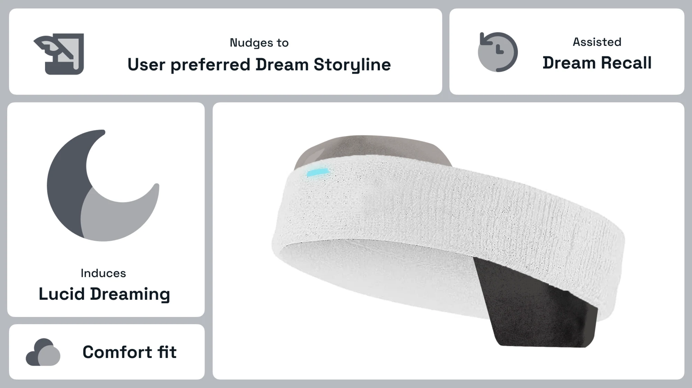
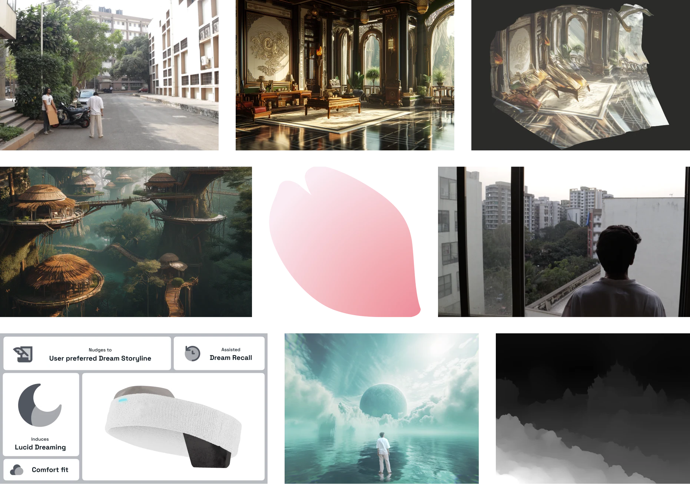

Links: https://youtu.be/LLwBg6ihaow?si=4rprEIn_NiYYmoqj

## What would *you* do if you could live in your dreams?

Humans spend 1/3 of their lives sleeping, so what if we could use that time to explore new worlds. We often have this escapist fantasy and this sense of adventure, in this speculative design course I wanted to look how people would sleep in 2050.

Lucid dreaming is where you are aware that you are dreaming and can control them to a certain extent. I speculate that in the future we could induce lucidity and maybe even nudge our brains to follow a certain narrative as well. 

> It doesn’t always work, but when it does…its worth remembering.

— Priyansh Adeshra  *Dreamstate user*
> 

To address ethical concerns, the device operates entirely offline, ensuring no data is transmitted externally. A key feature is its moderation of lucid dreaming, with only a 30-40% chance of inducing it to avoid negative health effects from overuse. The device is also designed to recognize and reject overuse, limiting the duration of lucid dreaming and requiring breaks between uses to prevent any potential abuse.

Slingshot approach, where you understand the trends by looking at the past, was used to speculate the future. 

I would like to thank [Priyansh](https://www.linkedin.com/in/priyansh-adeshra-72b889221?utm_source=share_via&utm_content=profile&utm_medium=member_ios) for narrating and being a part of this project, and to [Sid](https://www.linkedin.com/in/siddharth-agarwal-68a824221?utm_source=share_via&utm_content=profile&utm_medium=member_ios) for helping out in misc tasks.
