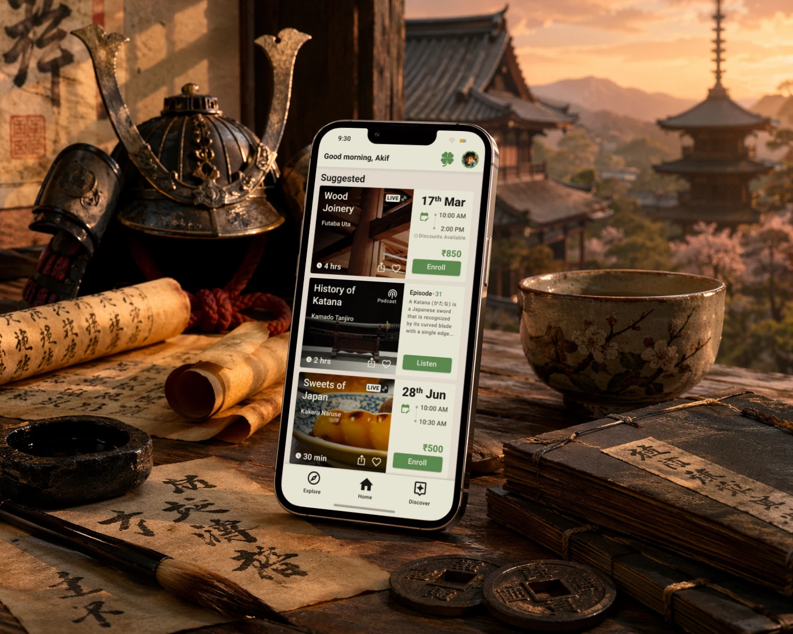
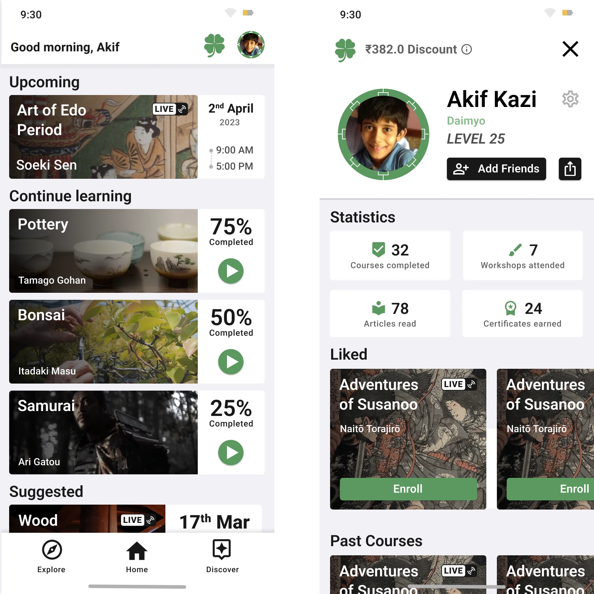
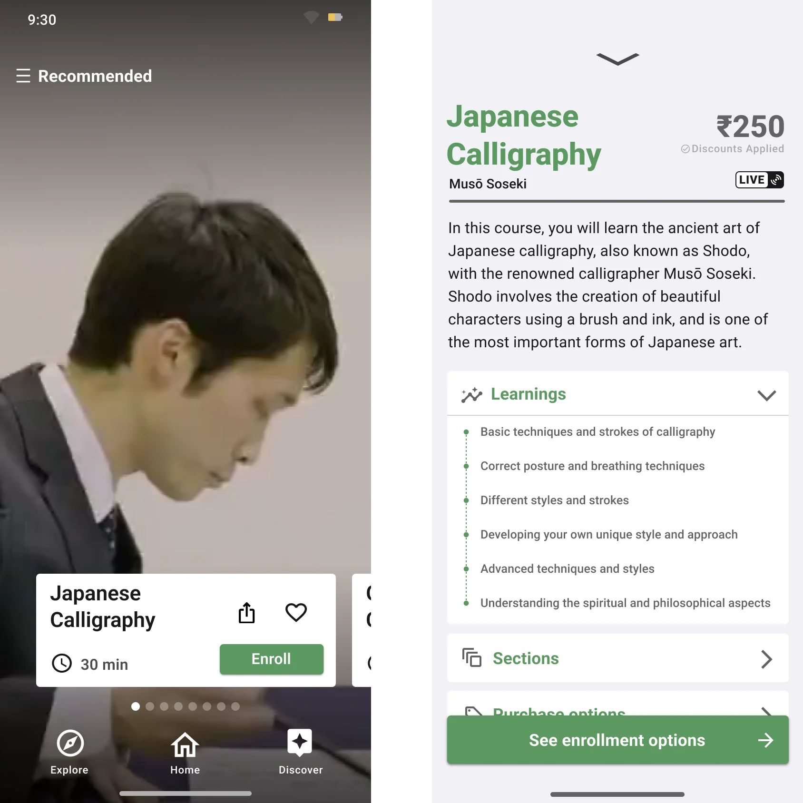
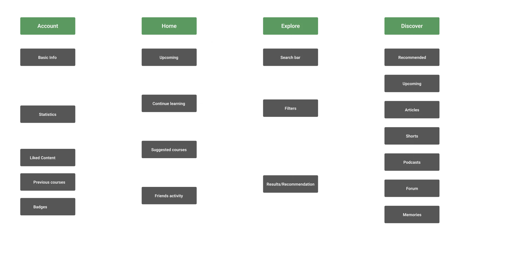
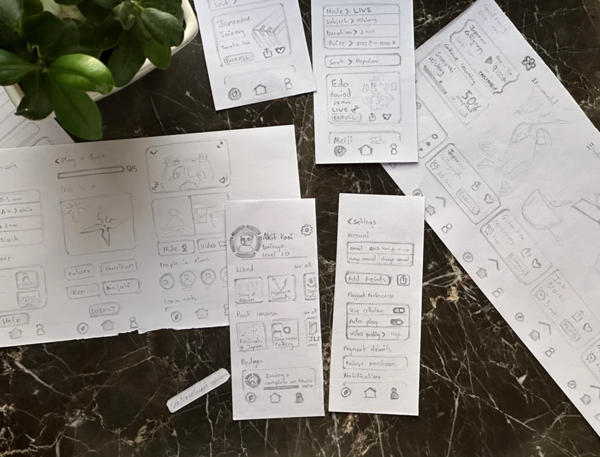
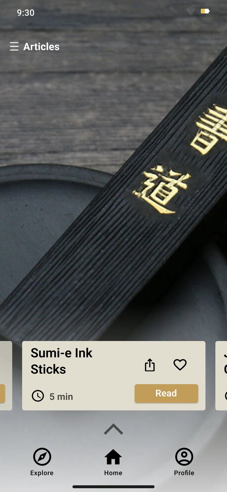
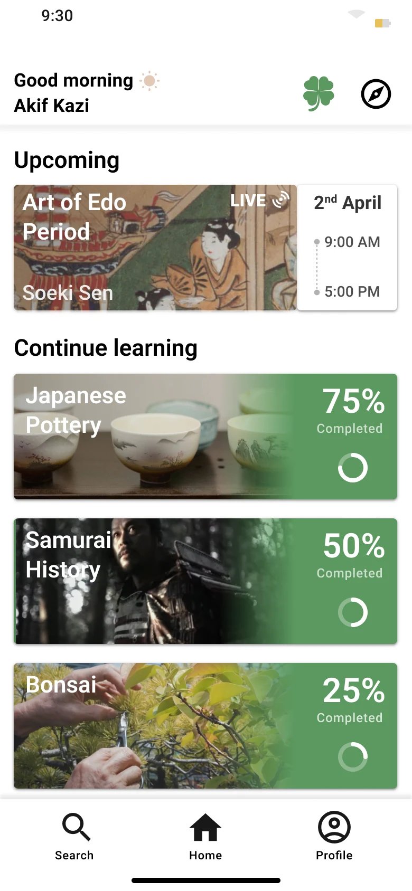

I’ve always been drawn to culture, especially the kind that feels just out of reach. East Asian culture has a certain richness and mystique that wasn’t part of the media I grew up with, and I know I’m not alone in wanting to understand it better. This platform exists for people like us: a place that brings together carefully curated resources to help you explore, learn, and connect more deeply.

I designed the Discover screen in 2022 to surface curated snippets from longer videos, making it easier to engage with cultural content in shorter bursts, while keeping a clear path to the full material.

Since then, short-form content has become a dominant pattern across platforms, with products like Google Arts & Culture adopting similar approaches.

That shift has led to some reflection. While it lowers the barrier to entry, it can also encourage passive, consumption-first behavior. This project was always meant to go further, to foster a deeper appreciation of cultural context and craftsmanship. The challenge now is to keep Discover accessible, while guiding users toward more meaningful engagement.

---

Some earlier variants…

