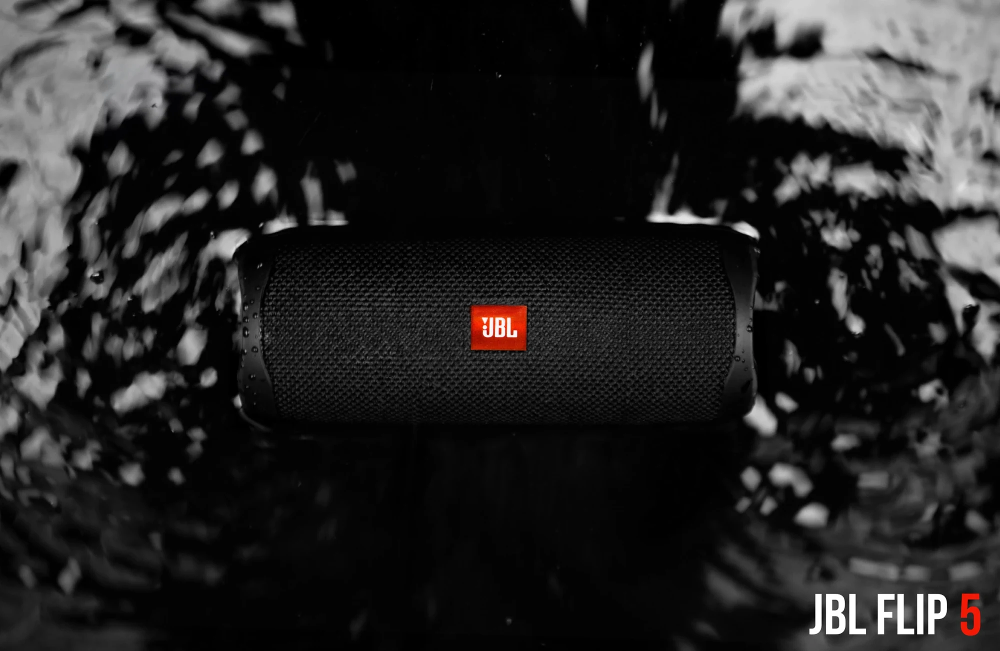
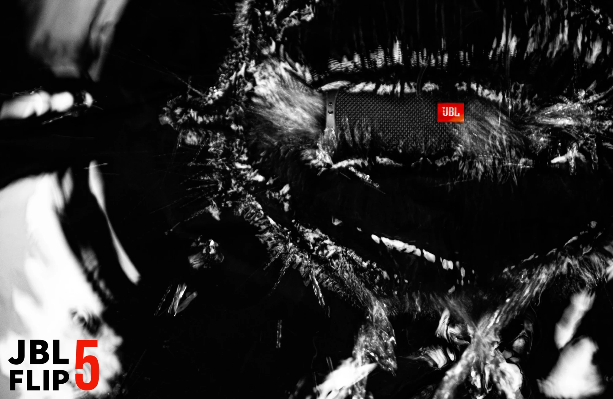
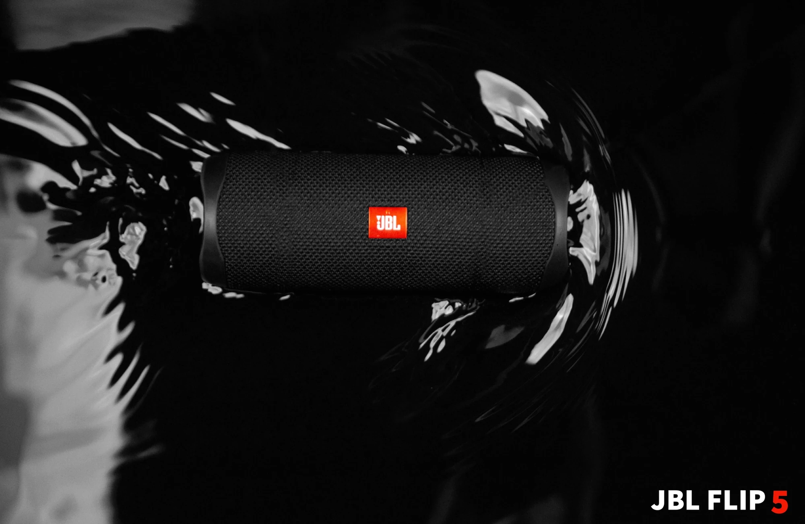

I would like to thank my team members [Aayush](https://www.linkedin.com/in/aayush-mishra-a26415191/), [Ansh](https://www.linkedin.com/in/ansh-somaiya-7410a6222/), [Priyansh](https://www.linkedin.com/in/priyansh-adeshra-72b889221/) and [Sahil](https://www.linkedin.com/in/sahil-jaunjare-b8622a283/), without whom our class would have flooded.

Special thanks to [Ami Somaiya](https://www.linkedin.com/in/ami-somaiya-62873710/) (Ansh’s mom) for providing us with her precious Nikon camera.
