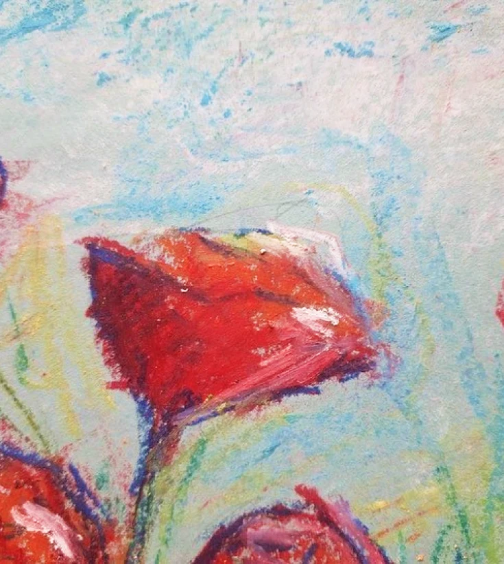

Over the years, I’ve experimented with a variety of materials and tools. While I haven’t been able to include all of my work here, and some pieces have unfortunately been lost or never documented. I’m nevertheless excited to share a selection of them with you. 

---

## Graphite

 videos on shading techniques](image-1.webp)

 and was featured on their official Instagram account. It draws on the Maratha style to portray Bhau Daji, set against an iconic Victorian-era floral design of the museum](image-2.webp)

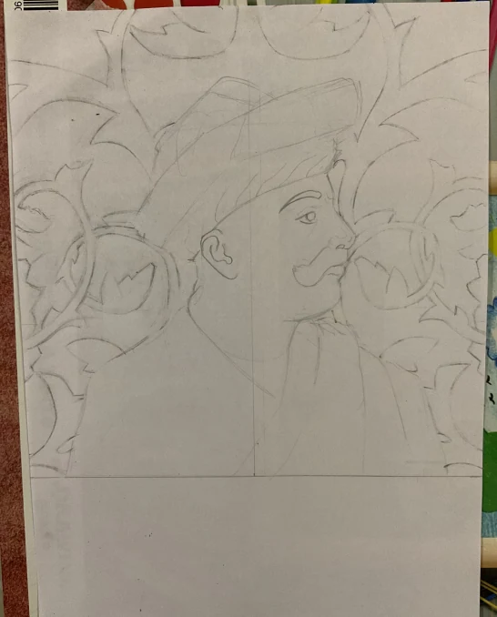

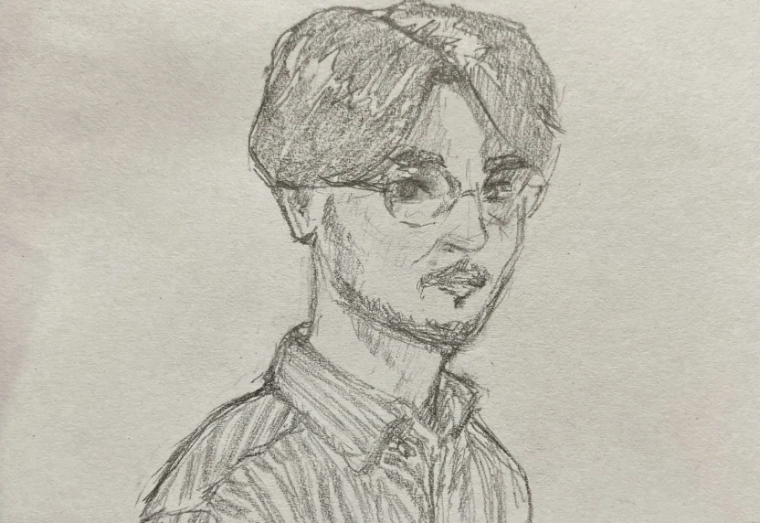

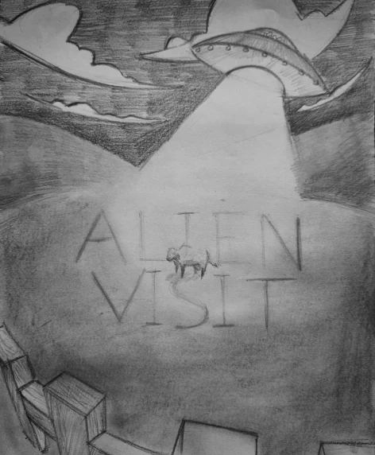

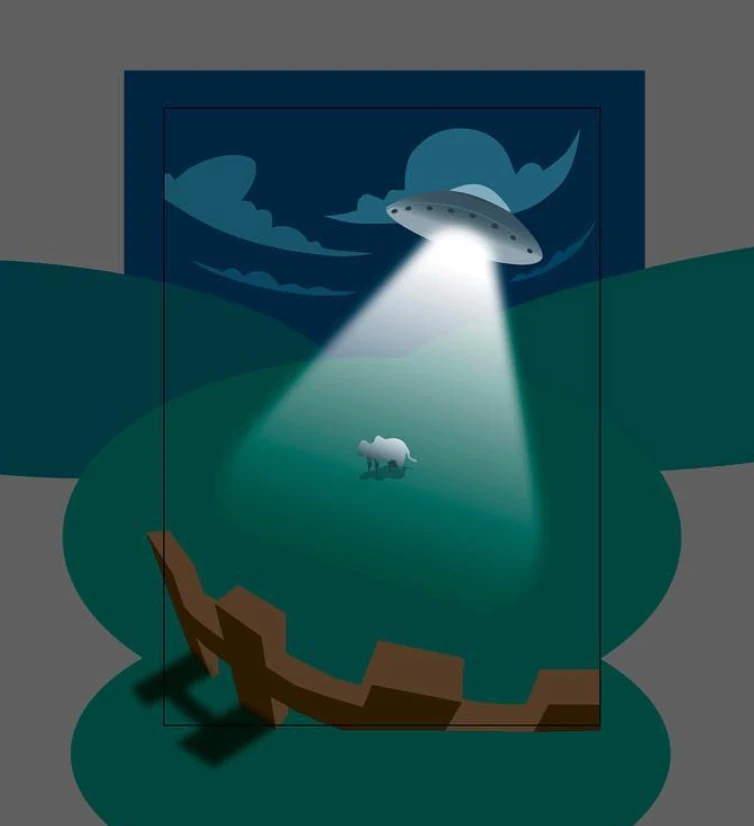

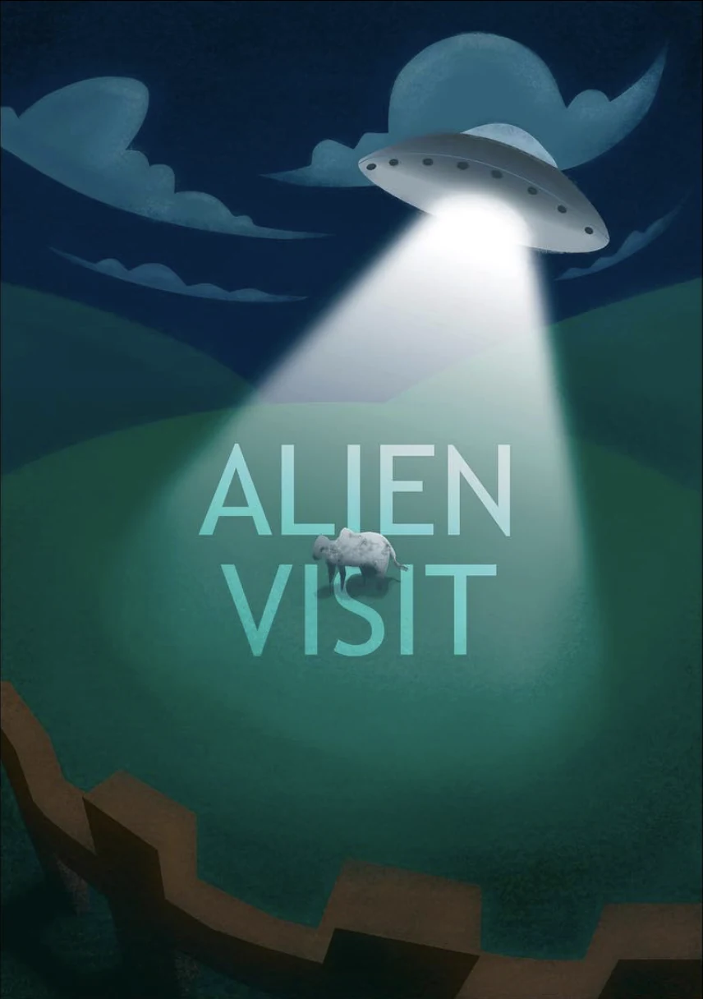

 that I made during my bachelors](image-8.webp)

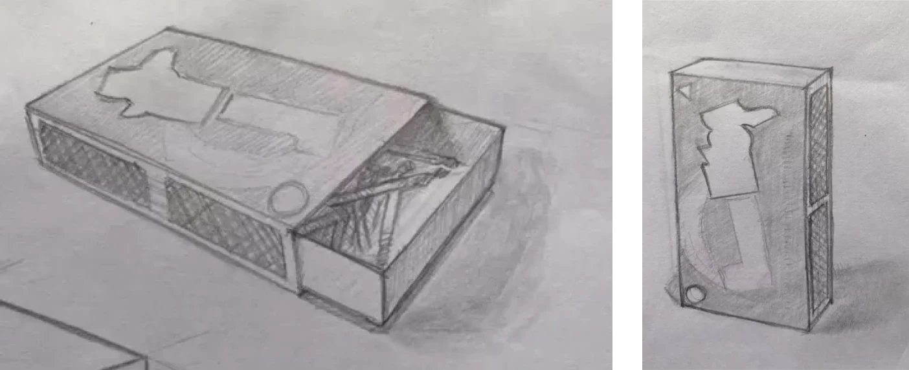

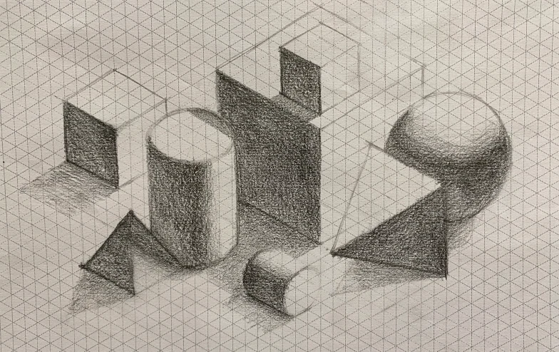

---

## Charcoal

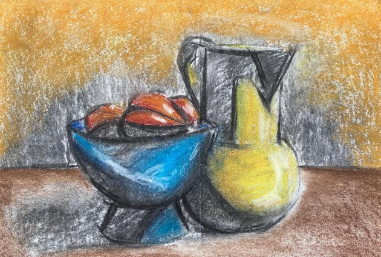

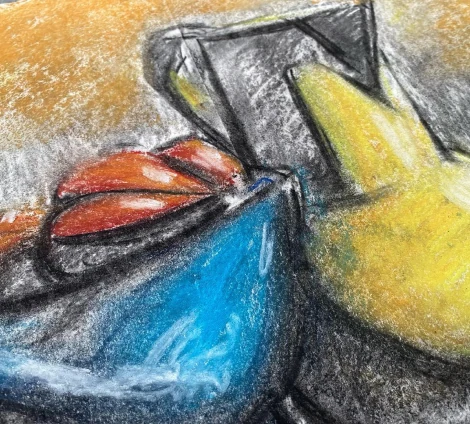

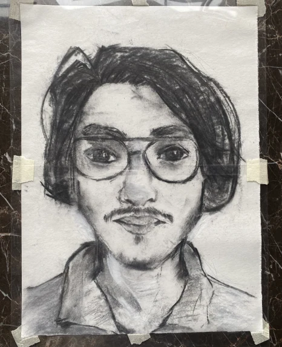

---

## Sakura Micron

’s main character drawing buildings, I wanted to give that style a shot as well](image-14.webp)

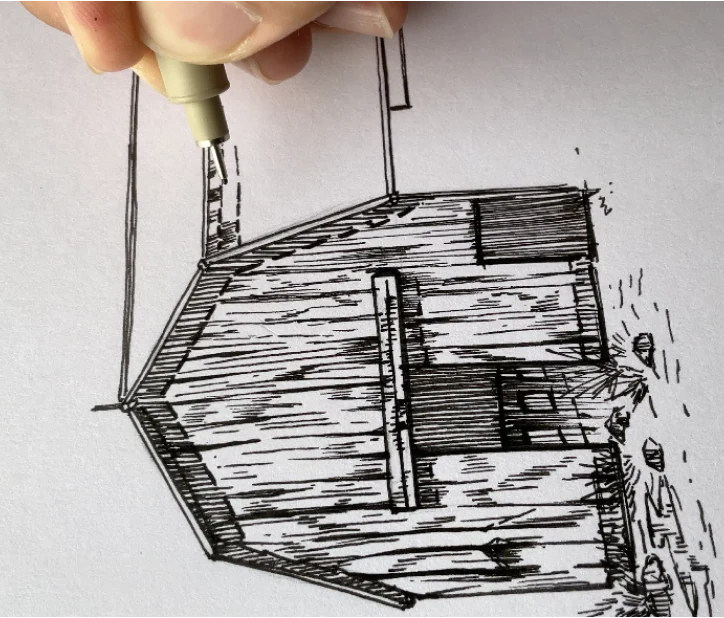

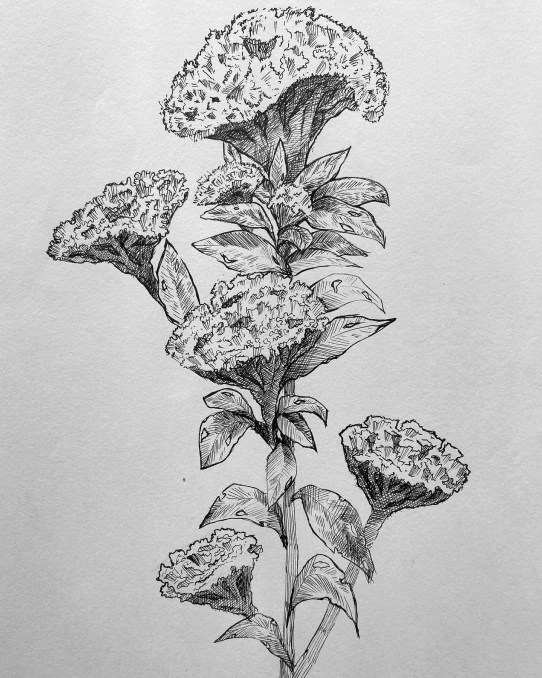

---

## Acrylic drip

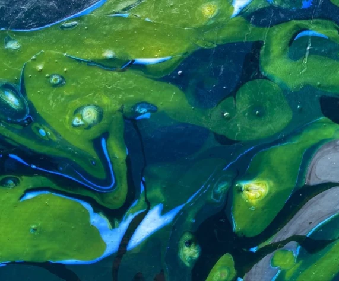

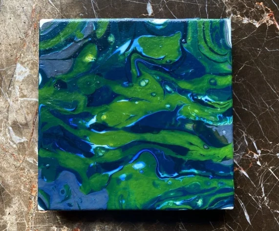

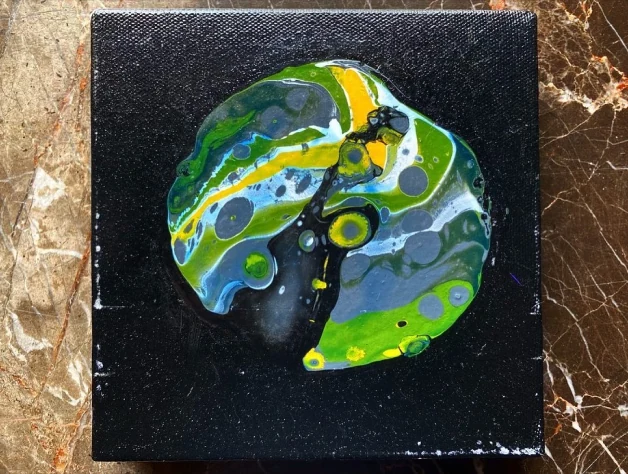
