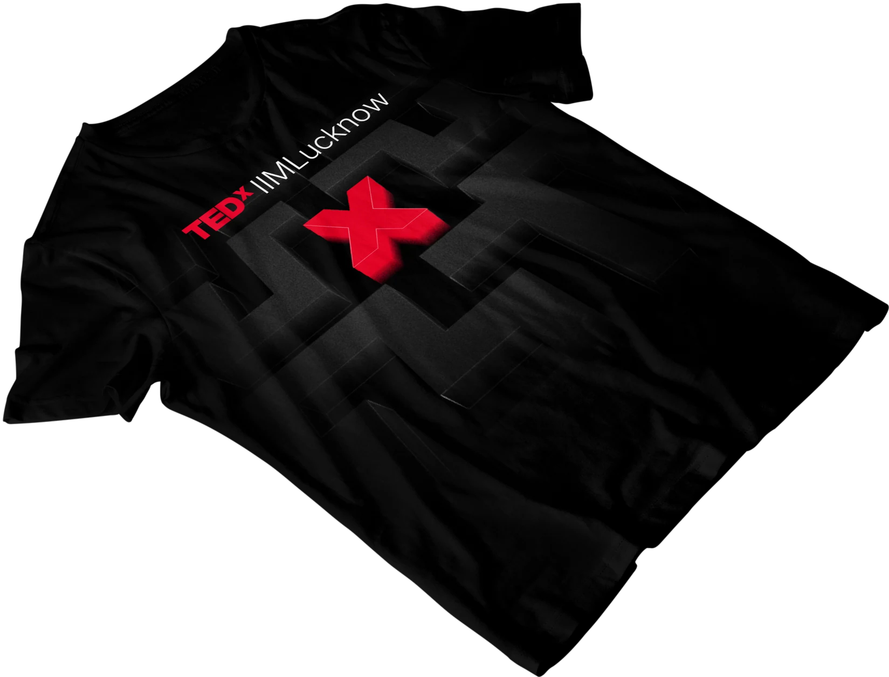
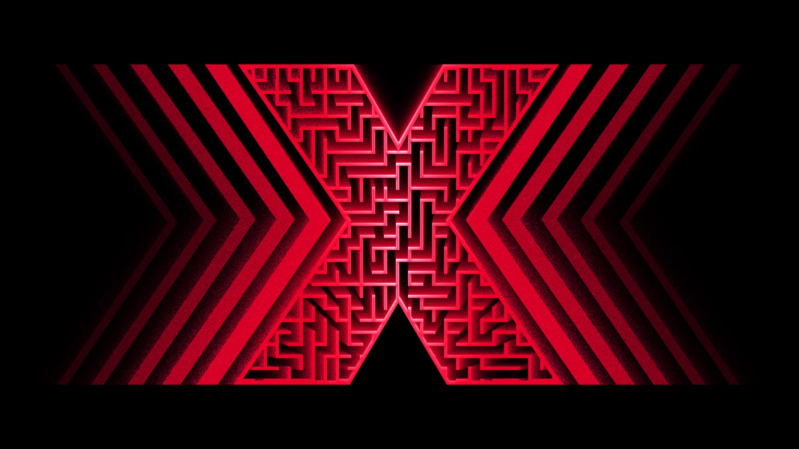
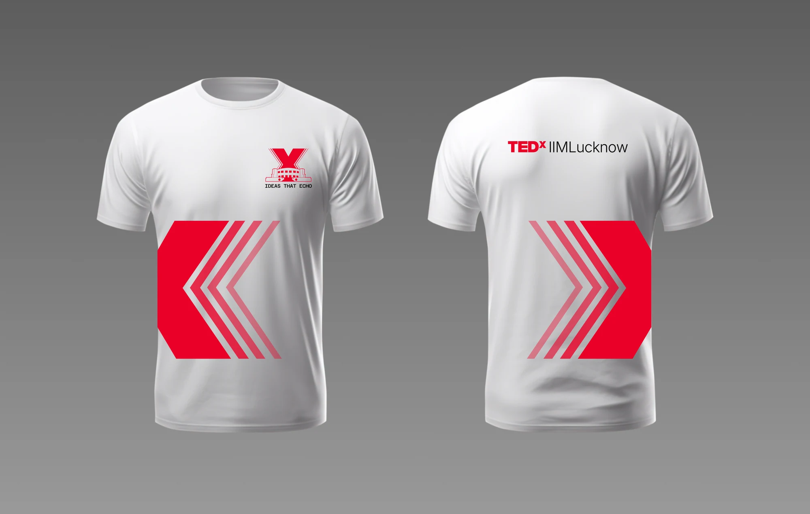

::: toggle Show code for MazeGen

```jsx
// DISPLAY CONSTS
const CELL_WIDTH = 10;
const CELL_HEIGHT = 10;

const MAZE_COLOR = 'white';
const STACK_COLOR = 'white';

// MAZE GEN CONSTS
const MAZE_WIDTH = 40;
const MAZE_HEIGHT = 40;

const DIR = {
  NORTH: {x:  0, y: -1},
  SOUTH: {x:  0, y:  1},
  EAST:  {x:  1, y:  0},
  WEST:  {x: -1, y:  0}
};

// The maze is represented as a graph of connected cells.
// Connection information is stored using an 8 bit binary number
// only the last 4 bits are actually used. The last 4 bits represent
// the direction of connection in NORTH, SOUTH, EAST, WEST order
// So a cell with the number 0b0110 would have a connection to the
// SOUTH and the EAST.
// The index of the array represents the cell's location in the maze
// using traditional flat array layout.
// I could have used a 2d array where graph[x][y] represents the 
// cell's location. I also could have used an object and booleans to 
// represent connection information like this
// {N: false, S: true, E: true, W: false}, but ultimately went for
// efficiency over readability. Because of this decision some areas of
// code below are poorly optimized. 🤷‍♂️
let graph = new Uint8Array(MAZE_WIDTH * MAZE_HEIGHT);
let visited = [];
let stack = [];

// Put the inital cell on the stack
// This could be any cell in the maze. 0 is top left, graph.length-1 is bottom right.
const START_CELL = Math.floor(Math.random()*graph.length);
visited.push(START_CELL);
stack.push(START_CELL);

function setup() {
  // The actual "cells" of the maze are spread out
  // There is an entire cells width between each cell
  // This width represents a wall. To connect two cells we
  // draw a "hall" cell between them.
  // We also include a buffer all the way around the maze.
  // So the full width of a 3x3 maze is
  // buffer + cell + hall + cell + hall + cell + buffer
  // Since the buffer and hall are the same width this is equivalent to
  // hall + cell + hall + cell + hall + cell + buffer
  // which is the same as
  // (hall + cell) * num_cells_in_row + buffer
  // and since hall width is the same as cell width is same as buffer width
  // cell * 2 * num_cells_in_row + cell
  createCanvas(
    CELL_WIDTH * 2 * MAZE_WIDTH + CELL_WIDTH, 
    CELL_HEIGHT * 2 * MAZE_HEIGHT + CELL_HEIGHT
  );
  frameRate(24);
}

function draw() {
  // If there are no cells on the stack then we are done
  // stop re-drawing the same maze over and over.
  if (stack.length === 0) {
    noLoop();
    return;
    
  

  }
  
  // ========== MAZE GENERATION LOGIC ========== //
  // Generation is done using Randomized depth-first search
  // https://en.wikipedia.org/wiki/Maze_generation_algorithm#Randomized_depth-first_search
  // pop a cell off the stack and check it's neighbors
  let curr_cell = stack.pop();
  
  // Only get the neighbors that we haven't visited yet
  let neighbors = getNeighborIndexes(curr_cell)
    .filter((el) => {
      return !visited.includes(el);
    });
  
  // if there is a neighbor we haven't visited
  if (neighbors.length > 0) {
    // push this cell back on the stack so we can re-check it later
    stack.push(curr_cell);
    // get a random neighbor
    const n = random(neighbors);
    // connect the current cell and the neighbor
    connectCells(curr_cell, n);
    // Add the neighbor to the visited cells and put it on the stack
    // this is the "recursive" step.
    visited.push(n);
    stack.push(n);
  }
  
  // ========== MAZE RENDERING LOGIC ========== //
  background(0);
  
  // Draw the visited cells 
  for (const cell of visited) {
    const p = GridGraph.IndexToXy(cell, MAZE_WIDTH);
    drawCell(p.x, p.y, MAZE_COLOR);
    
    // Check if the cell is connected to the south or east
    // if it is draw the connected hall
    if (graph[cell] & 0b00000100) {
      drawHall(p.x, p.y, DIR.SOUTH, MAZE_COLOR);
    }
    if (graph[cell] & 0b00000010) {
      drawHall(p.x, p.y, DIR.EAST, MAZE_COLOR);
    }
  }
  
  // Draw the cells currently on the stack
  for (const cell of stack) {
    const p = GridGraph.IndexToXy(cell, MAZE_WIDTH);
    drawCell(p.x, p.y, STACK_COLOR);
    
    // Check if the cell is connected to the south or east
    // if it is draw the connected hall
    if (graph[cell] & 0b00000100) {
      drawHall(p.x, p.y, DIR.SOUTH, STACK_COLOR);
    }
    if (graph[cell] & 0b00000010) {
      drawHall(p.x, p.y, DIR.EAST, STACK_COLOR);
    }
  }
  
  // Draw the starting and ending cells a slightly different color
  if (stack.length > 0) {
    const a = GridGraph.IndexToXy(stack[0], MAZE_WIDTH);
    drawCell(a.x, a.y, 'white');
    
    const z = GridGraph.IndexToXy(stack[stack.length-1], MAZE_WIDTH);
    drawCell(z.x, z.y, 'white');
  }
}

/**
* Updates the graph array so that ai and bi are connected.
* If ai and bi are not adjacent, this function doesn't do anything 
* (except waste CPU cycles).
*/
function connectCells(ai, bi) {
  if (getNeighbor(ai, DIR.NORTH) === bi) {
    graph[ai] = graph[ai] | 0b1000;
    graph[bi] = graph[bi] | 0b0100;
    return;
  }
  
  if (getNeighbor(ai, DIR.SOUTH) === bi) {
    graph[ai] = graph[ai] | 0b0100;
    graph[bi] = graph[bi] | 0b1000;
    return;
  }
  
  if (getNeighbor(ai, DIR.EAST) === bi) {
    graph[ai] = graph[ai] | 0b0010;
    graph[bi] = graph[bi] | 0b0001;
    return;
  }
  
  if (getNeighbor(ai, DIR.WEST) === bi) {
    graph[ai] = graph[ai] | 0b0001;
    graph[bi] = graph[bi] | 0b0010;
    return;
  }
}

/**
* Given a cell index and a direction as a DIR constant, this
* returns the index of the cell in that direction.
*/
function getNeighbor(i, dir) {
  switch (dir) {
    case DIR.NORTH:
      if (i - MAZE_WIDTH >= 0) return i - MAZE_WIDTH;
      return null;
    case DIR.SOUTH:
      if (i + MAZE_WIDTH < graph.length) return i + MAZE_WIDTH;
      return null;
    case DIR.EAST:
      if ((i + 1) % MAZE_WIDTH !== 0) return i+1;
      return null;
    case DIR.WEST:
      if (i % MAZE_WIDTH !== 0) return i-1;
      return null;
  }
}

/**
* TODO optimize this
*
* Returns an array of all cell indexes that neighbor the cell at
* the given index.
* 
* In a 3x3 maze the index of the center cell would be 4.
* This would return the array [3, 5, 1, 7];
*/
function getNeighborIndexes(i) {
  let n = [];
  let p = GridGraph.IndexToXy(i, MAZE_WIDTH);
  
  if (p.x > 0) 
    n.push(GridGraph.XyToIndex(p.x - 1, p.y, MAZE_WIDTH));
  if (p.x < MAZE_WIDTH-1) 
    n.push(GridGraph.XyToIndex(p.x + 1, p.y, MAZE_WIDTH));
  
  if (p.y > 0) 
    n.push(GridGraph.XyToIndex(p.x, p.y - 1, MAZE_WIDTH));
  if (p.y < MAZE_HEIGHT-1) 
    n.push(GridGraph.XyToIndex(p.x, p.y + 1, MAZE_WIDTH));
  
  return n;
}

/**
* Draws a square in the hall between two cells. The hall's location
* is given as a cell and a direction from a cell, NORTH, SOUTH, EAST, 
* or WEST. 
*
* The x and y position is the cell's location in the maze. 
* ie an integer from 0 to MAZE_WIDTH - 1 or MAZE_HEIGHT - 1
* 
* dir is one of the DIR constants.
*/
function drawHall(x, y, dir, color) {
  fill(color);
  noStroke();
  
  if (x + dir.x >= MAZE_WIDTH || x + dir.x < 0) return;
  if (y + dir.y >= MAZE_HEIGHT || y + dir.y < 0) return;
  
  let cx = CELL_WIDTH  + x * CELL_WIDTH  * 2;
  let cy = CELL_HEIGHT + y * CELL_HEIGHT * 2;
  
  // offset the hall according to the direction
  cx += dir.x * CELL_WIDTH;
  cy += dir.y * CELL_HEIGHT;
  
  rect(cx, cy, CELL_WIDTH, CELL_HEIGHT);
}

/**
* Draws a square at this cells location.
* The x and y position is the cell's location in the maze. 
* ie an integer from 0 to MAZE_WIDTH - 1 or MAZE_HEIGHT - 1
*/
function drawCell(x, y, color) {
  fill(color);
  noStroke();
  
  let cx = CELL_WIDTH  + x * CELL_WIDTH  * 2;
  let cy = CELL_HEIGHT + y * CELL_HEIGHT * 2;
  
  rect(cx, cy, CELL_WIDTH, CELL_WIDTH);
}

```

:::




