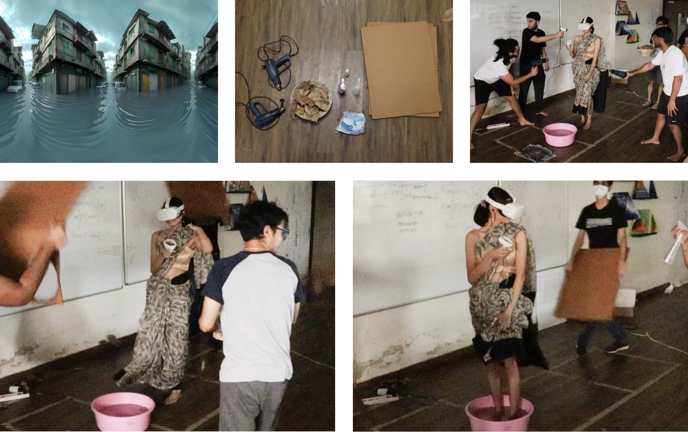

Links: https://youtu.be/hJlQ0sBljJ4?si=29jjjVjSXntCfoX9
More links: https://youtu.be/vDapDf_1c5k?si=EHu3GCcaBkbXNxEB

My team mates for this 3 day hackathon were: [Ansh Somaiya](https://www.linkedin.com/in/ansh-somaiya-7410a6222?utm_source=share_via&utm_content=profile&utm_medium=member_ios), [Divyansh Gandhi](https://www.linkedin.com/in/divyanshgandhi18?utm_source=share_via&utm_content=profile&utm_medium=member_ios), [Ninad Kadam](https://www.linkedin.com/in/ninadkadam?utm_source=share_via&utm_content=profile&utm_medium=member_ios) and [Siddharth Agarwal](https://www.linkedin.com/in/siddharth-agarwal-68a824221?utm_source=share_via&utm_content=profile&utm_medium=member_ios).
