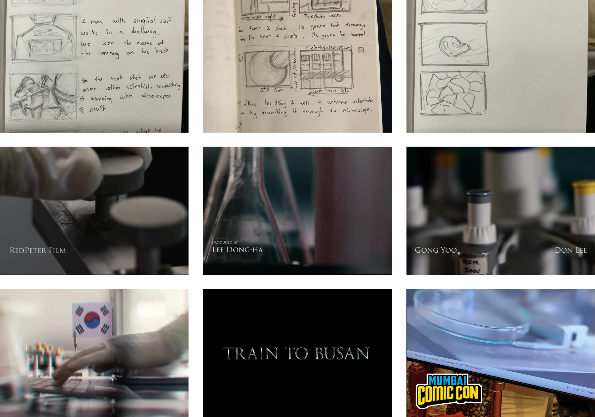

Links: https://youtu.be/5R_wRDcfuKo?si=5iC9fu6IasBBZObO

For this digital typography course we were tasked to create/reimagine a title sequence of a piece of media. I chose to go with the hit Korean zombie film ‘Train to Busan’

‘The Upisde Down’ is property of Kyle Dixon and Michael Stein.

Thanks [Ansh](https://www.linkedin.com/in/ansh-somaiya-7410a6222?utm_source=share_via&utm_content=profile&utm_medium=member_ios) for playing the role of the researcher.
