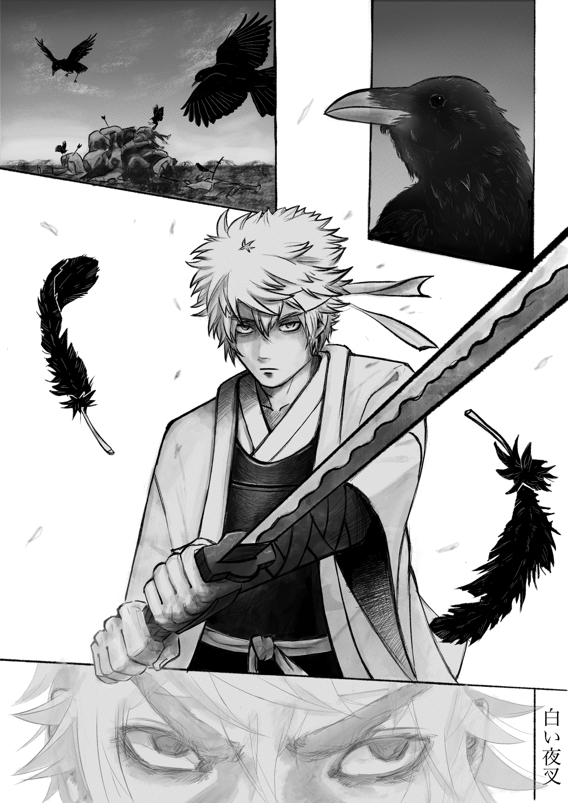
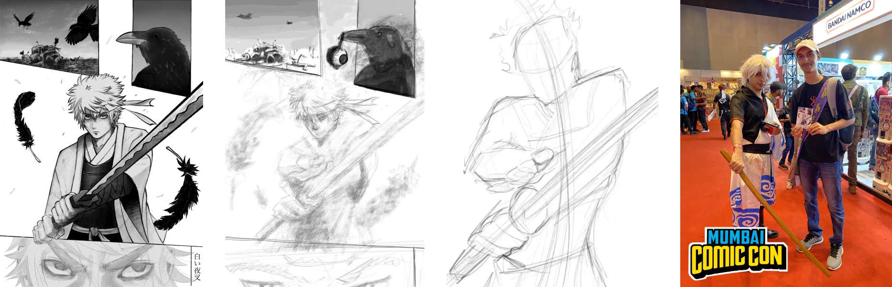

Gintama is known for its crude humour and as its main protagonist Gintoki is also depicted as a lighthearted character. However, people often forget that he has a far more darker and somber past, and I aimed to capture it in this piece titled “Shiroyasha—The white Demon”.

