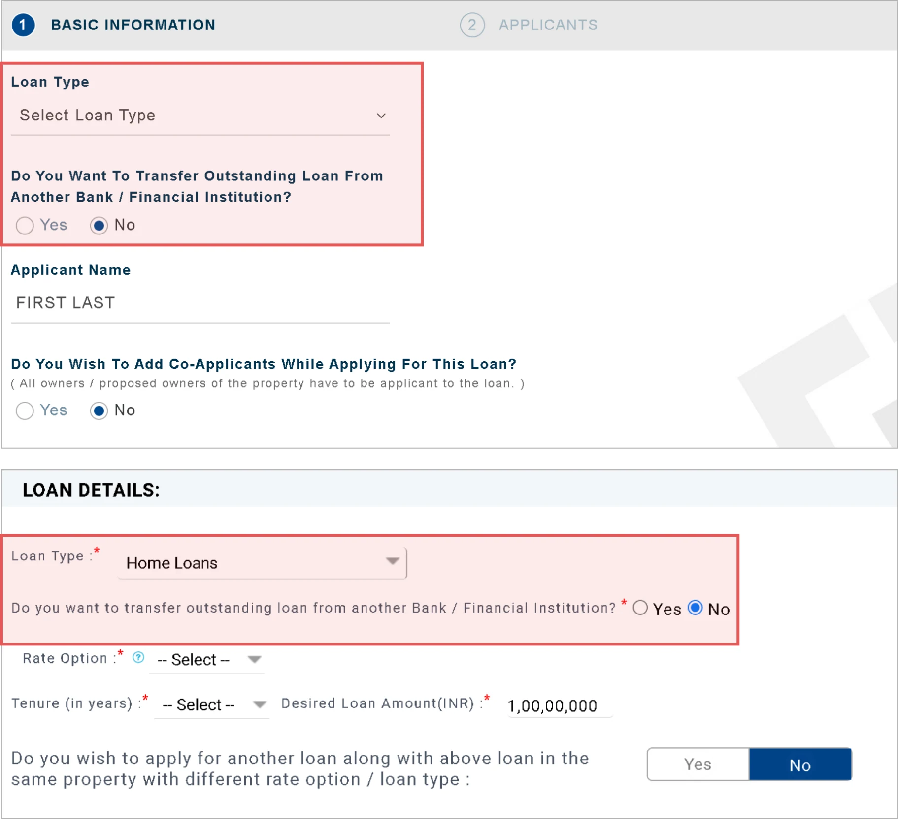
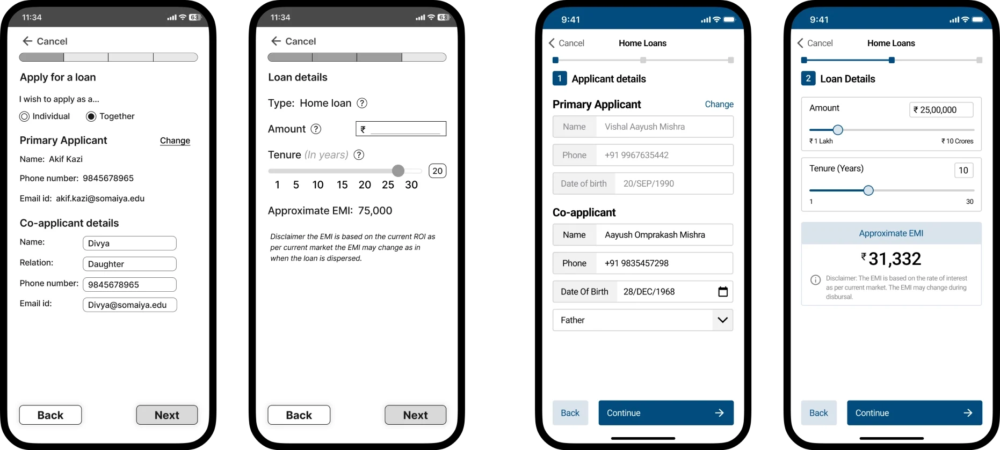
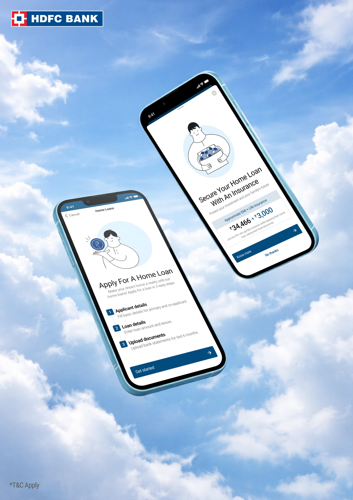

## Why can’t I just open the app and download my sanction letter in one click?

What is the crucial information that a bank requires from a person which they don’t already have?

I wanted to steer towards this goal, but in the process realised that making it too easy can also be a bad thing!

---

#### The bank needs to know you can pay their money bank, the more indication of your capacity the better

Payslips, EMIs, Co-applicant, Insurance, Bank statements, Tax invoice etc are some of the primary ways to know your capacity.

#### But do we really need to give so much information?

Can’t the bank look at our bank account data, our spendings and salary deposits? 

#### What if we could use digilocker for verifications

Its a more convenient (for the urban users) and traceable method to verify an applicant

#### UPI shook the banking and finance sector, India is leading cashless transactions (GoI PIB, 2025)

Younger audience especially prefer using UPI over carrying cash (MoSPI, 2025), many Institutions and organisations are increasingly adapting cashless transactions in their premises as well (KSRTC, 2025). We need such kind of dramatic change in loans as the current model is simply too roundabout and complex, requiring multiple rounds of checks and verifications from different bodies, and endless forms.

Such questions and thought process lead me to making a newer version of the HDFC Home Loans application (for sanction letter).

#### But why did I take HDFC over others?

Primarily due to familiarity, my family has long-standing relationships with HDFC, and access to staff provided valuable insights.

However, secondary research suggests that while HDFC is strong institutionally, it faces challenges in digital efficiency. Reports of app outages, usability issues, and outdated interaction flows indicate gaps in reliability and user experience compared to newer fintech-driven solutions.

---

## Currently…

### Mobile vs Desktop

> [!tip]
> Users prefer mobile overall for banking convenience, but they shift to desktop when the task becomes complex, risky, or cognitively heavy

| Mobile App | Desktop Website |
| --- | --- |
| High adoption in India (~70%+ traffic from mobile) ([Digital Silk](https://www.digitalsilk.com/digital-trends/mobile-vs-desktop-traffic-share/?utm_source=chatgpt.com)) | Lower usage share (~30%), but still critical for key tasks ([Digital Silk](https://www.digitalsilk.com/digital-trends/mobile-vs-desktop-traffic-share/?utm_source=chatgpt.com)) |
| Preferred for quick, frequent, low-effort tasks (balance check, UPI, small payments) | Preferred for complex, high-stakes tasks (loans, financial decisions, documentation) |
| Perceived as more convenient, accessible, and always available ([igbr.org](https://www.igbr.org/wp-content/Journals/Articles/GJMM_Vol_7_No_1_2023%20pp%2033-45.pdf?utm_source=chatgpt.com)) | Perceived as better for focus, accuracy, and control (larger screen, fewer errors) |
| Users choose mobile for easier / lower importance activities ([Nielsen Norman Group](https://www.nngroup.com/articles/large-devices-important-tasks/?utm_source=chatgpt.com)) | Users switch to desktop for important or difficult tasks ([Nielsen Norman Group](https://www.nngroup.com/articles/large-devices-important-tasks/?utm_source=chatgpt.com)) |
| Faster interaction (biometrics, saved data, app integrations like UPI/DigiLocker) | Better visibility of forms, documents, and comparisons (loan terms, EMI, tenure) |
| Limited screen space → higher cognitive load for long forms | Large screen → easier to review, compare, and validate inputs |
| Works well for on-the-go, real-time actions (payments, alerts) | Works better for deliberate decision-making workflows (loan applications) |
| Higher engagement frequency (daily usage behavior) | Lower frequency, but longer, more focused sessions |

The current system is over-complex regardless of device, but device choice amplifies the problem. 

Mobile → Friction due to form density

Desktop → Friction due to redundancy and repetition

> [!tip]
> The goal is not just to simplify the flow, but to make high-stakes tasks feel safe and effortless across devices, especially on mobile, where users increasingly start their journey.

---

## Personas

### Primary Persona
First Time Home Buyer

Rahul Mehta is a 29 y.r software engineer from Pune earning ₹18L p.a.

Mental model 

Banking is an invisible utility he relies on. He sees loans as tools to execute decisions already made, not products to evaluate, and blames institutions when friction arises.

Usage Context

Applies on mobile during short windows but hesitates to commit there. Regular CRED and Zerodha user. Expectations shaped by seamless UPI and investing apps, not traditional banking.

| End Goals | Experience Goals | Life Goals |
| --- | --- | --- |
| Determine eligibility quickly | Feel in control and well informed | Own an asset before 32 |
| Get a sanction letter  | Not be surprised by mid-flow requirements | Reduce monthly outflow vs rent |
| Know the monthly cost | Feel process proportionate to stakes | Build financial independence |

Observed Behaviours

Compares rates across HDFC, SBI, and aggregators like BankBazaar before opening any app.

Uses EMI calculators as a primary decision tool, not just reference.

Calls helpline only as a last resort, prefers to resolve independently.

Critical Pain Points

Jargon without tooltips: 'LTV ratio', 'FOIR', 'co-obligation' appear without explanation.

No progress indicator that accounts for 'async' steps (bank review, verification by third parties).

---

### Secondary Persona
Experienced but Anxious Re-applicant

Sunita Rao is a 44 y.o school principal from Bengaluru earning ₹28L p.a.

Mental Model

Banking signals risk to Sunita, mistakes feel consequential. With prior loan experience, she equates complexity with legitimacy, so unusually fast, simple flows raise concern. Seriousness must match the decision’s weight is her benchmark.

Usage Context

Uses desktop to submit, mobile to track status. Cross-checks on paper (prints, notes) and has a joint application with her husband. Seeks reassurance via branch calls. Past loan experience (marked by repeated document requests) drives her anxiety.

| End Goals | Experience Goals | Life Goals |
| --- | --- | --- |
| Avoid document rejection due to format or content errors | Feel the bank is taking her application seriously | Secure financial stability for her family future |
| Have clear audit trail of things submitted and pending | Not feel foolish when completing financial forms | Not have loan application errors delay home purchase |
| Complete application with few bank visits | Have human fallback available without needing to start over | Feel capable of managing large financial decisions independently |

Observed Behaviours

Downloads and reads the full home loan brochure before opening the app.

Double-checks every field before submitting a form page.

Reads confirmation screens multiple times before proceeding and prints them as backup.

Critical Pain Points

Lack of human acknowledgement and reassurance.

No visibility into bank-side processing, what happens after submission is a black box

---

---

## Prototyping

[Open Figma prototype](https://www.figma.com/proto/4YewlSey3Eni5zeo14afe1/HDFC-Akif-s-Work?page-id=136%3A1336&node-id=3264-3268&p=f&viewport=300%2C410%2C0.05&t=aXy9P3wcBdta3wZ9-1&scaling=scale-down&content-scaling=fixed&starting-point-node-id=3264%3A3268)

---

[Usability Testing](usability-testing/)

I made a report after conducting Usability Testing, it includes all the feedbacks and impressions

### Key Impression

> The simplified loan process creates a sense of uncertainty and lack of trust.
> 

Although participants were able to complete the task successfully, many did not feel confident in the process.

> [!note]
> Task completion ≠ Perceived reliability

The system currently optimises for speed, but in doing so, it reduces the perceived seriousness and trustworthiness of a high-stakes process like a home loan. However, this simplification was appreciated by users with no prior home loan experience.

Of course, this feedback came from people who had already gone through an actual home loan process so seeing an application finishing in minutes felt out of place for them, for the participants who have never applied it was a great process.
