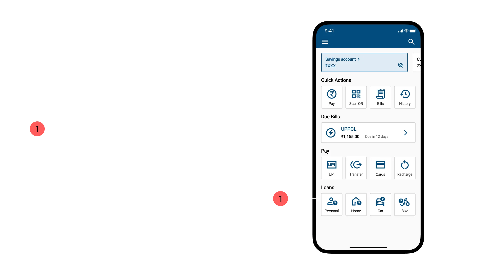
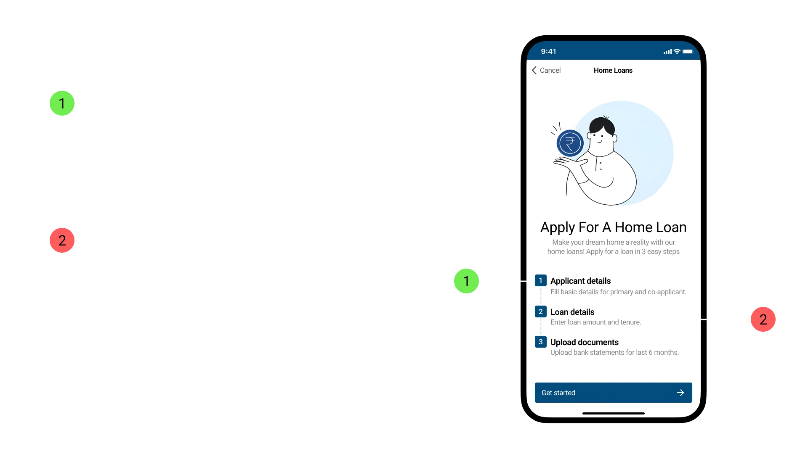
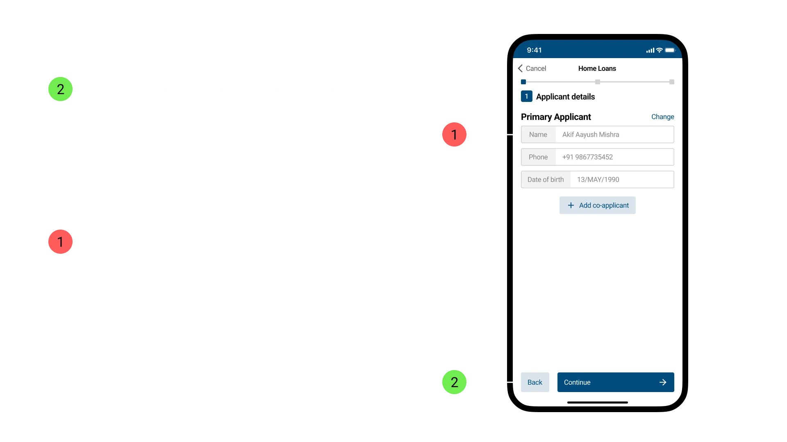
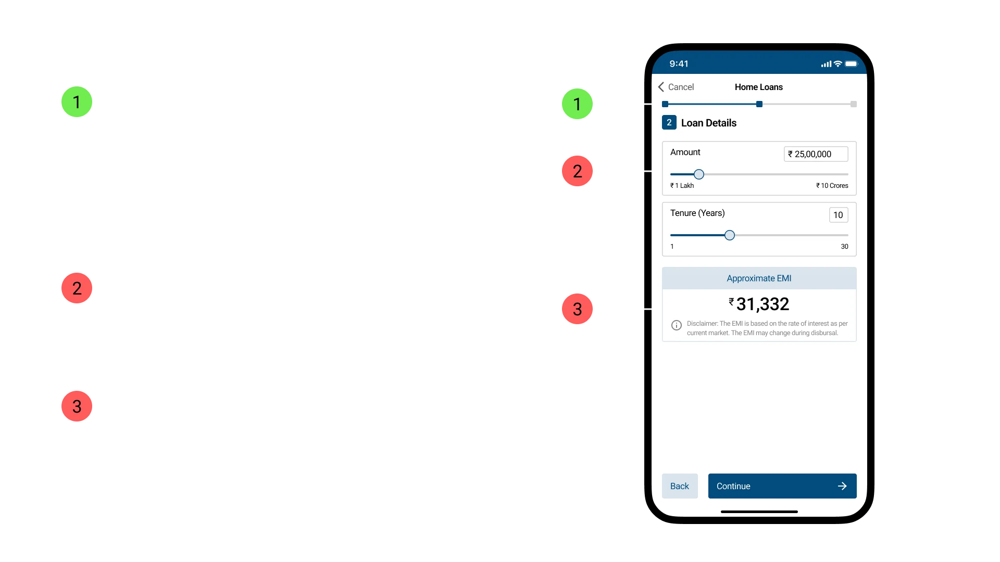
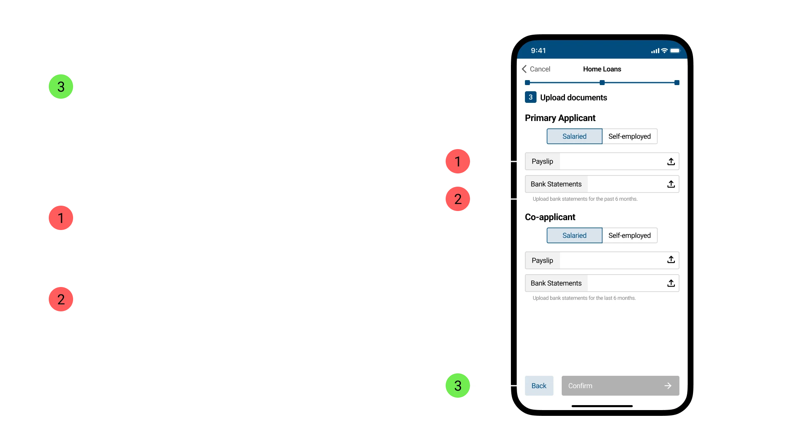
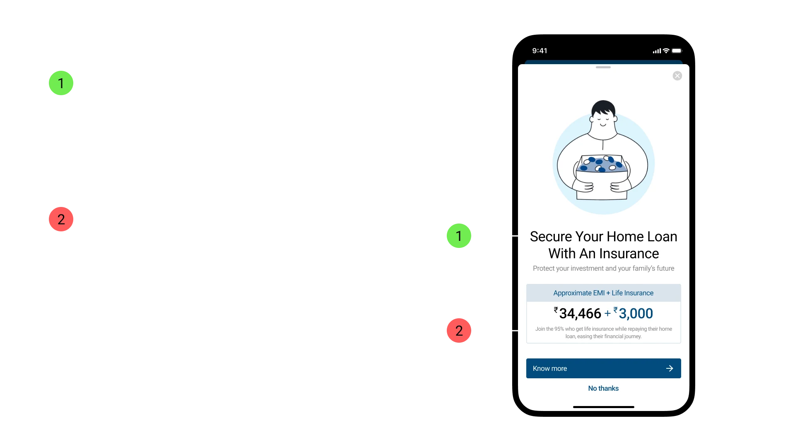
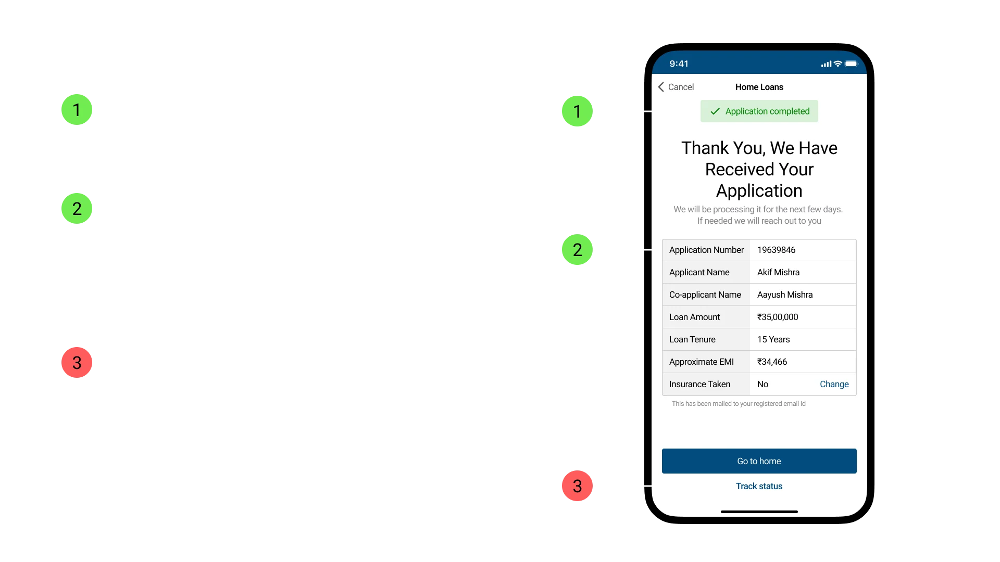

This report presents a comprehensive evaluation of the functionality and effectiveness of the redesigned HDFC app, based on 11 user testing sessions conducted to identify areas for improvement.

It examines how the redesigned app helps users apply for home loans while avoiding information overload. It also identifies potential issues users may encounter during the application process. The report documents the findings and highlights what worked and what did not.

---

## Validation Methodology

Think-aloud Protocol → Expectancy tests → Performance tests → Questionnaires → Debriefing

---

## Overall Impressions

> “Easy to navigate and access the services that I need”
> 

> “The simplification of the loan process makes it feel unreliable and uncertain”
> 

> “The look and feel can be more youthful and vibrant”
> 

## Survey Feedback

| Statement | Score (out of 5) |
| --- | --- |
| It does what I want efficiently | 4.5 |
| I am satisfied with it | 4.5 |
| It is user-friendly | 4.5 |
| I learned to use it quickly | 4.8 |
| It is simple to use | 4.8 |
| Its terminology is familiar to me | 4 |
| It works the way I want it to work | 4 |
