> [!important]
> This project is now under development and a pilot test will be conducted in July with full implementation planned later this year.

## Context

Somaiya School of Design (SSD), offers materials to all students for free provided they use them responsibly. Currently they use a physical ledger to track the inventory, borrows and returns. 

---

## Goal

---

## Research Methodology

| **Method** | **Detail** | **Why** |
| --- | --- | --- |
| **Interviews** | Caretakers, Students, Manager | Identify pain points, mental models, behaviour patterns |
| **Literature review** | Physical ledger, Invoices, Current solutions | Item categorisation, Borrowing and returning patterns, Benchmarking and best practices |
| **Modelling** | Personas and journey maps | Synthesising and prioritising research, identifying opportunity areas and directions |

---

## Problem Analysis

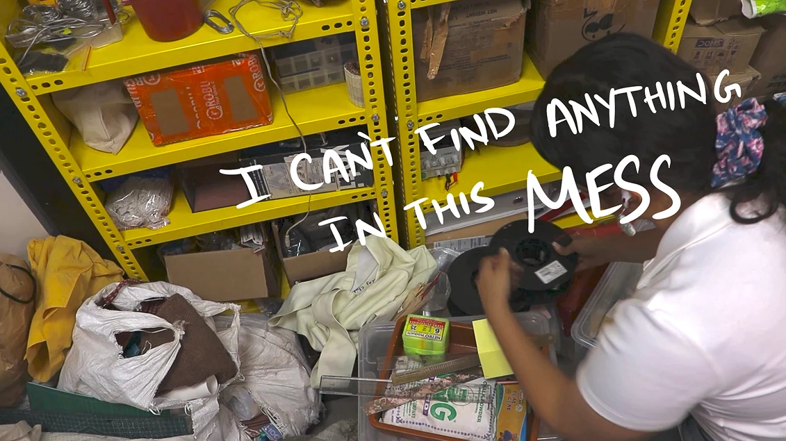

### Lack of traceability

led to Bulk buying, Misuse and loss of materials.

### Impatient students

were reluctant to log small items in the physical ledger which was often misplaced.

### Caretaker overloaded

by spending time searching for items and checking stock by sight.

---

## Personas

### Flow-driven

::: columns 1 3

+++
Goal:: Get the item fast and continue working
Reality:: Small tasks feel like interruptions
Tension:: System feels slower than her need
Risk:: Small exceptions become normal behaviour

> [!tip]
> Make doing it right faster than skipping it
:::

### System compensator

::: columns 1 3

+++
Goal:: Keep things organised and available
Reality:: Spends time fixing gaps in the system
Tension:: System doesn’t support his work
Risk:: Becomes overloaded and reactive

> [!tip]
> Reduce reliance on memory and manual effort
:::

### Risk-avoiding decision maker

::: columns 1 3

+++
Goal:: Ensure materials are always available
Reality:: Doesn’t trust inventory data
Tension:: Checking takes longer than buying
Risk:: Over-purchasing and hidden waste

> [!tip]
> Make inventory reliable enough to trust quickly
:::

---

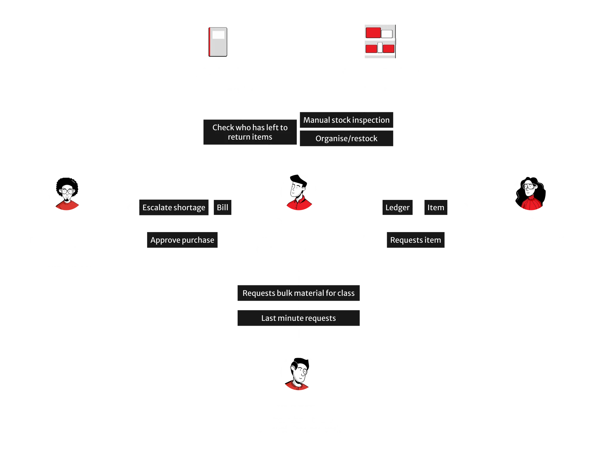

---

::: toggle ## IoT

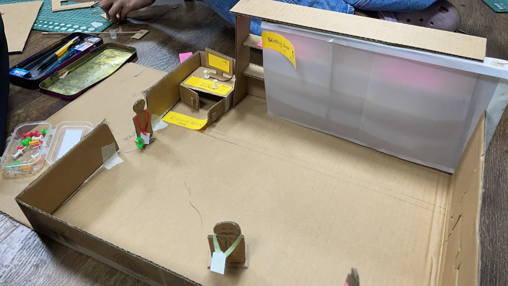

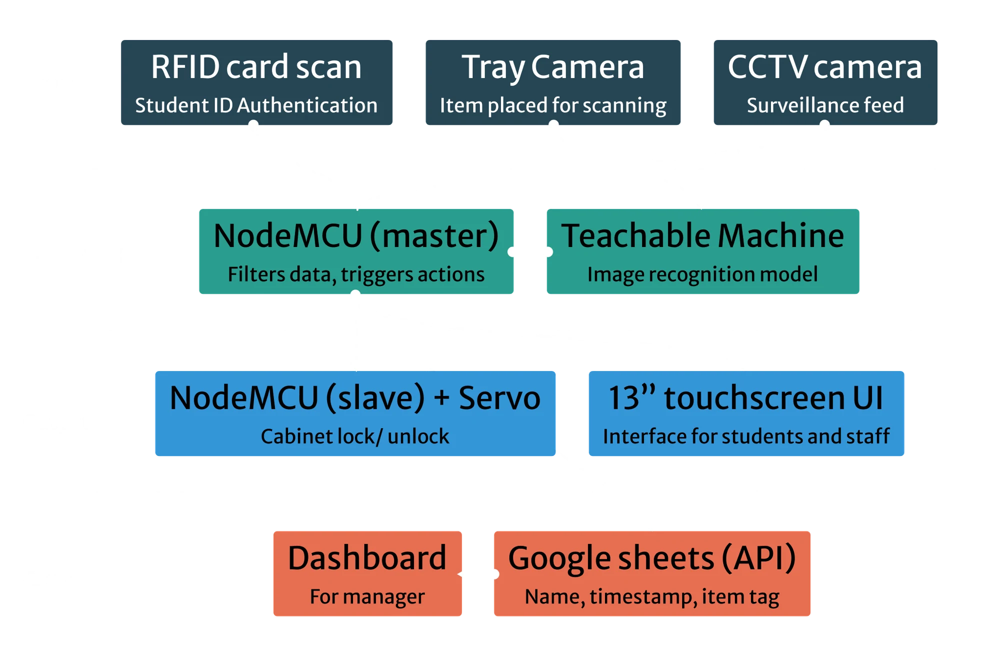

---

## RFID Scan

Nikita scans my College ID card using an RFID scanner module connected to a NodeMCU IoT device. This NodeMCU is linked to a Google Sheets file via an API key. Upon scanning the ID, the system records the name and timestamp in the Google Sheets file.

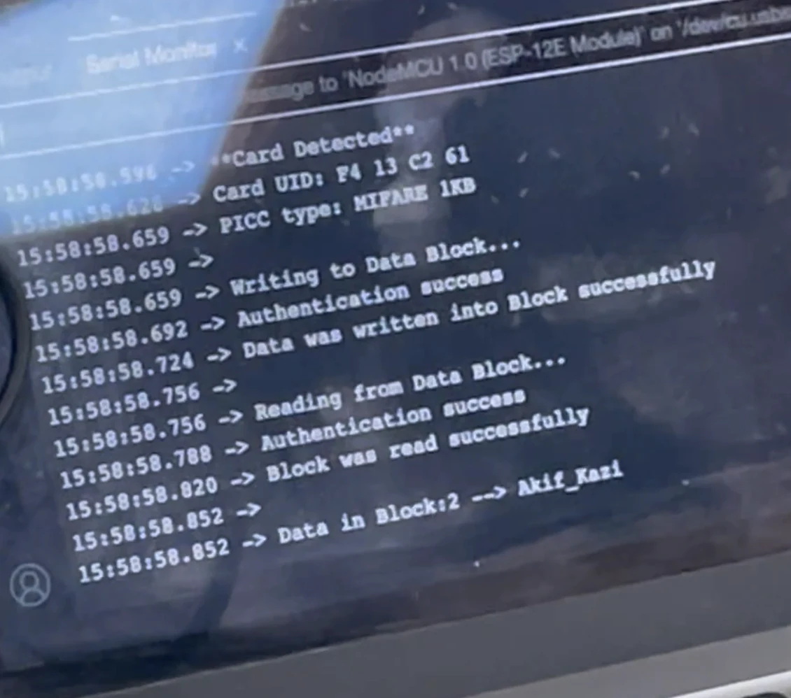

---

## Locking/Unlocking

After scanning the College ID card, the NodeMCU sends a command to another NodeMCU equipped with a servo (held by Ann) to lock or unlock. The NodeMCU also adds the Name and timestamp of the user to the google sheets file.

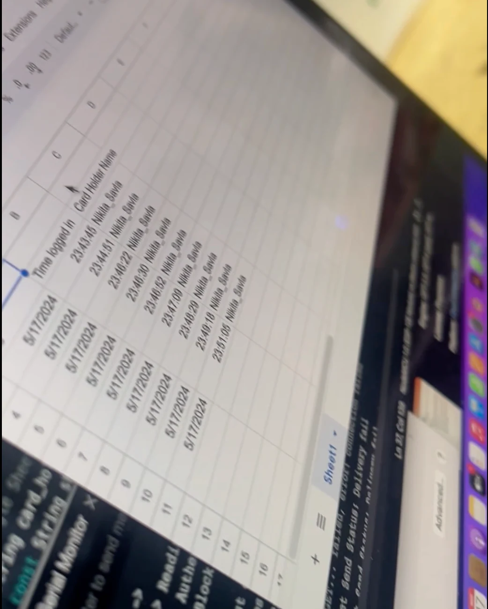

---

## Image Recognition (My role)

In the Gif below, I place items on a tray under a webcam connected to a laptop. The video feed is processed by p5.js, which incorporates a Google Teachable Machine model. This model identifies the items and displays their names on the screen.

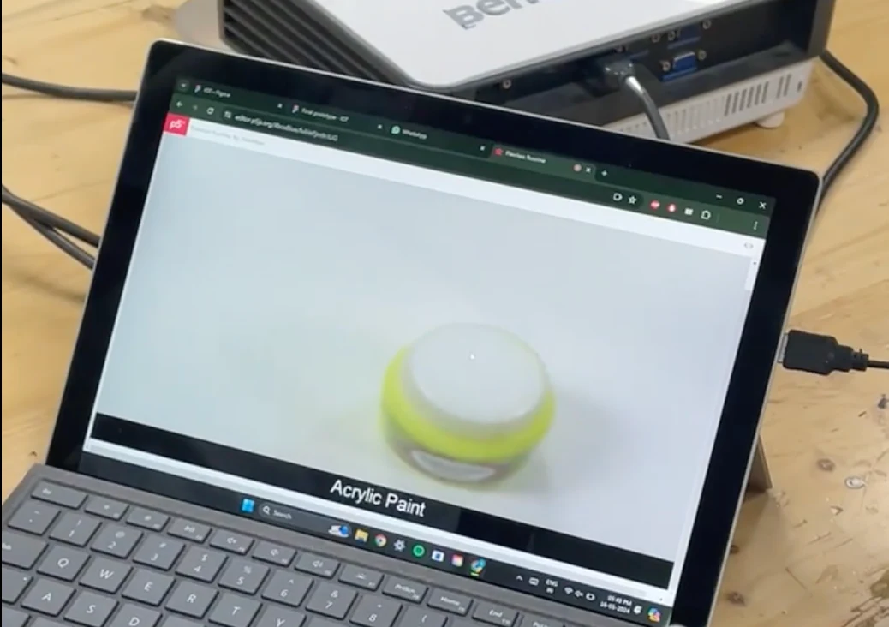

:::

---

## Interventions

### Categorising items into

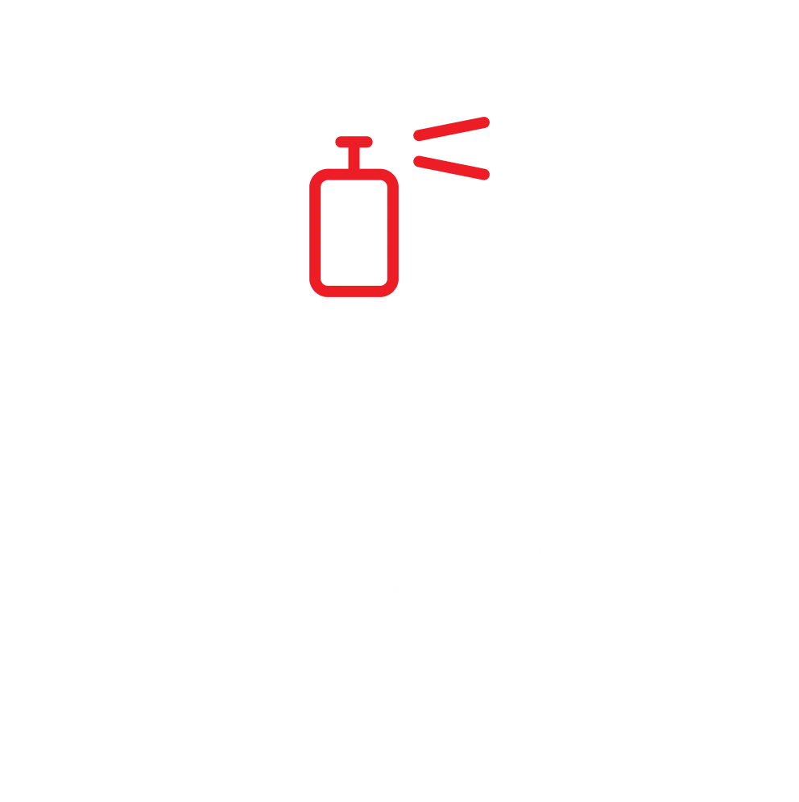

with each requiring different levels of authentication for borrowing. 

Through literature review (ledger):: Most students were borrowing common stationary items, they do not need a full authentication and verification procedure.

> [!important]
> Implemented successfully; data to follow.

### Placing Low Priority items in classrooms

to track monthly class usage and to spot waste or theft. 

Through literature review (ledger) and interview:: Having stationary in their classroom means easier access.

> [!important]
> Implemented successfully; data to follow.

### Giving course materials to students

so that they don’t have to borrow.

Through interview:: Having the stationary provided course based means easier access and traceability.

> [!important]
> Implemented successfully; data to follow.

### Return empty containers

to make sure there is no theft through excuse of “it got empty so I threw it away”.

Through interview:: Students came up with ways to bypass the system, above loophole was exploited repeatedly.

> [!important]
> Implemented successfully; data to follow.

### IoT Integration

for mid and higher-value materials, 

- Students scan their RFID card to log in, triggering CCTV and unlocking the cabinet.
- They place selected items on a tray for camera-based identification and logging.
- They confirm the issuance and leave.

> [!tip]
> If the process was too complex, students might avoid returning items altogether, but a lax system could lead to theft.

## Future Interventions

### The caretaker decides

if items were returned and are fit to re-borrow. 

Through testing:: IoT return flow was easy to abuse

### Change terminology from “Issuing” to “Borrowing”

to show its not their property and needs to be returned. 

Through interviews:: “Issuing” felt abstract to the students

---

## Prototyping

::: toggle ## Low Fidelity Wireframes

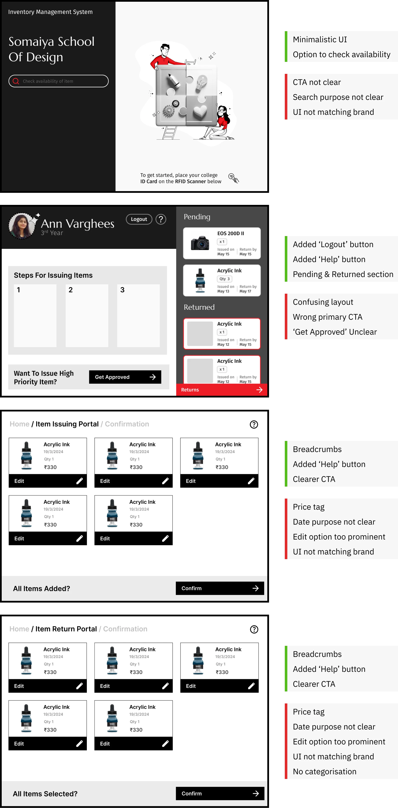

:::

::: toggle ## Mid Fidelity Wireframes

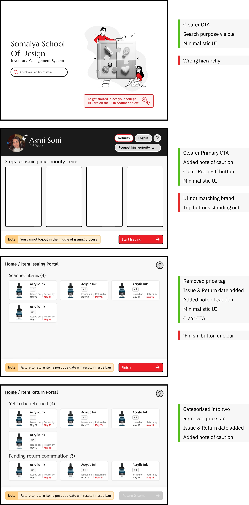

:::

## Final Prototype

[Open Figma prototype](https://www.figma.com/proto/2OWywu8gJRPyhtyurh4B0L/IOT?node-id=230-6756&node-type=canvas&t=PUBSfHhojf4JOhaT-1&scaling=contain&content-scaling=fixed&page-id=29%3A593&starting-point-node-id=230%3A6756)

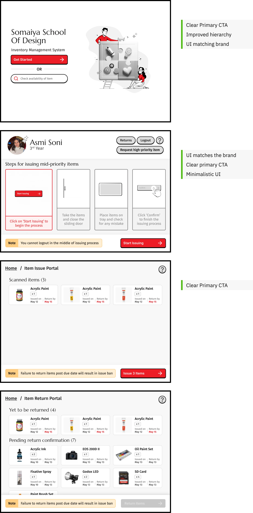

---

## Reflection and way forward

People will behave like people, its not their fault, the system bears responsibility of preventing misuse and reducing bottlenecks.

As the goal was to move from a reactive system to a proactive one, the next step should be to enable automations and test the long term results.

<small>Some of the Illustrations in this project are the property of Hunaid Nagaria ([Source](https://www.behance.net/gallery/116357407/UI-Illustrations-Riidl-Academy)) and Evana Moniz</small>
