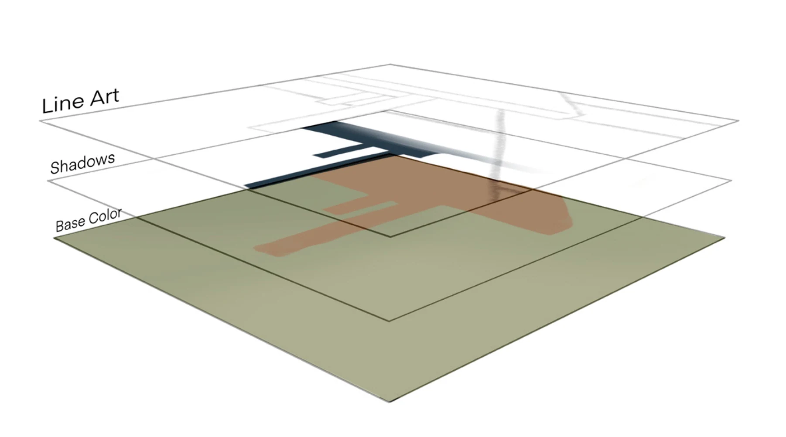
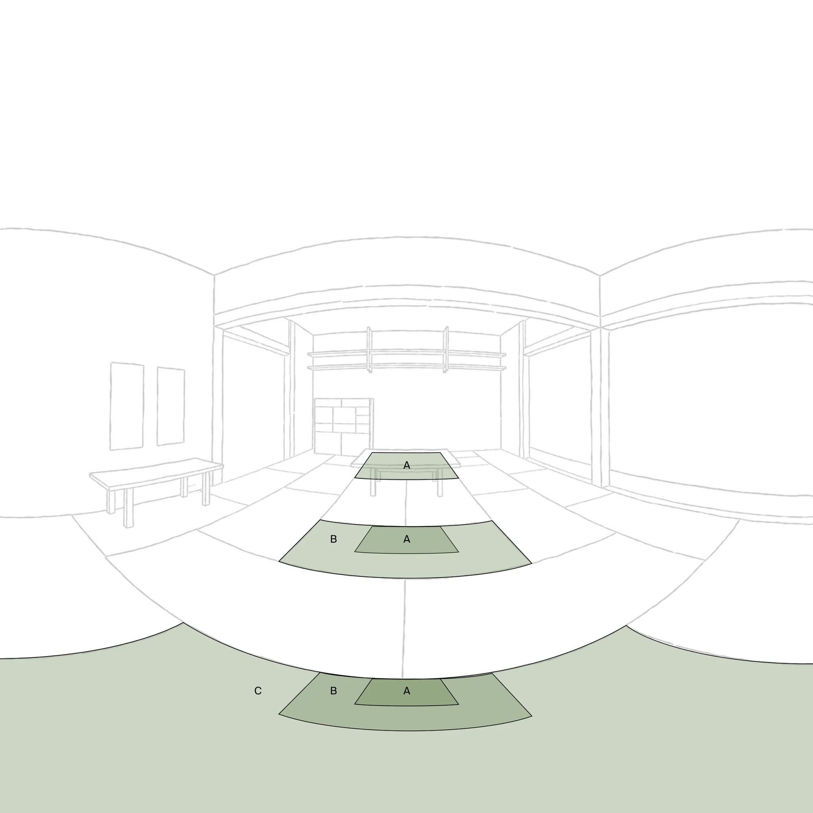
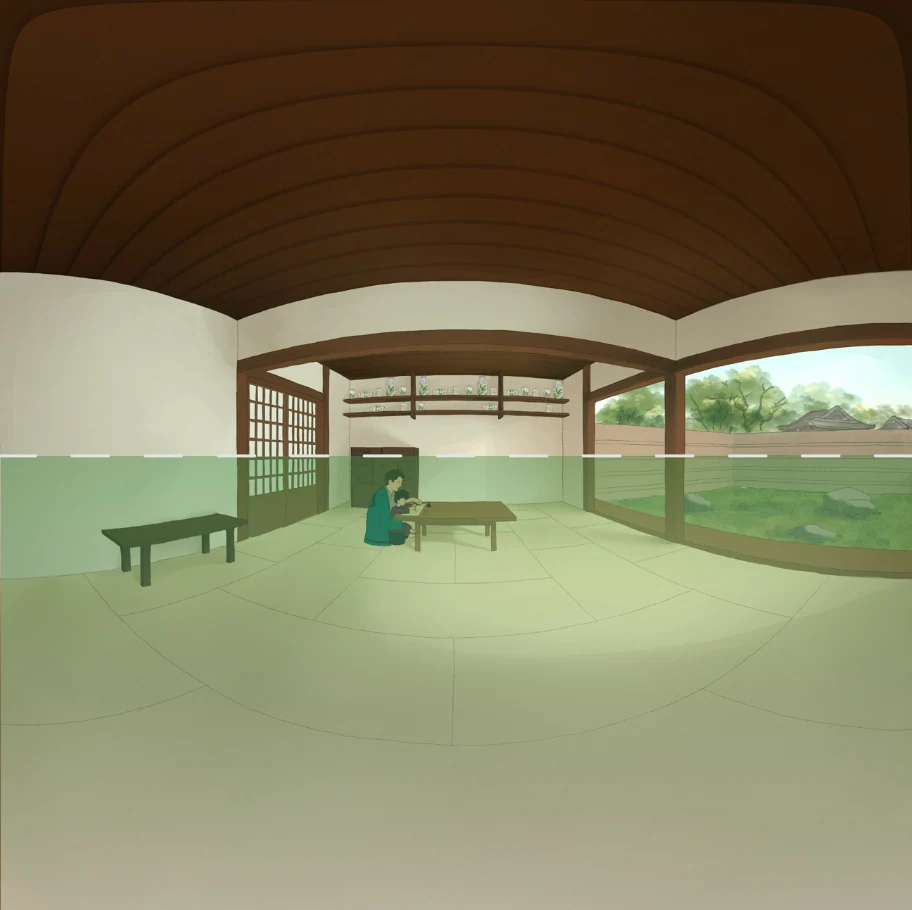
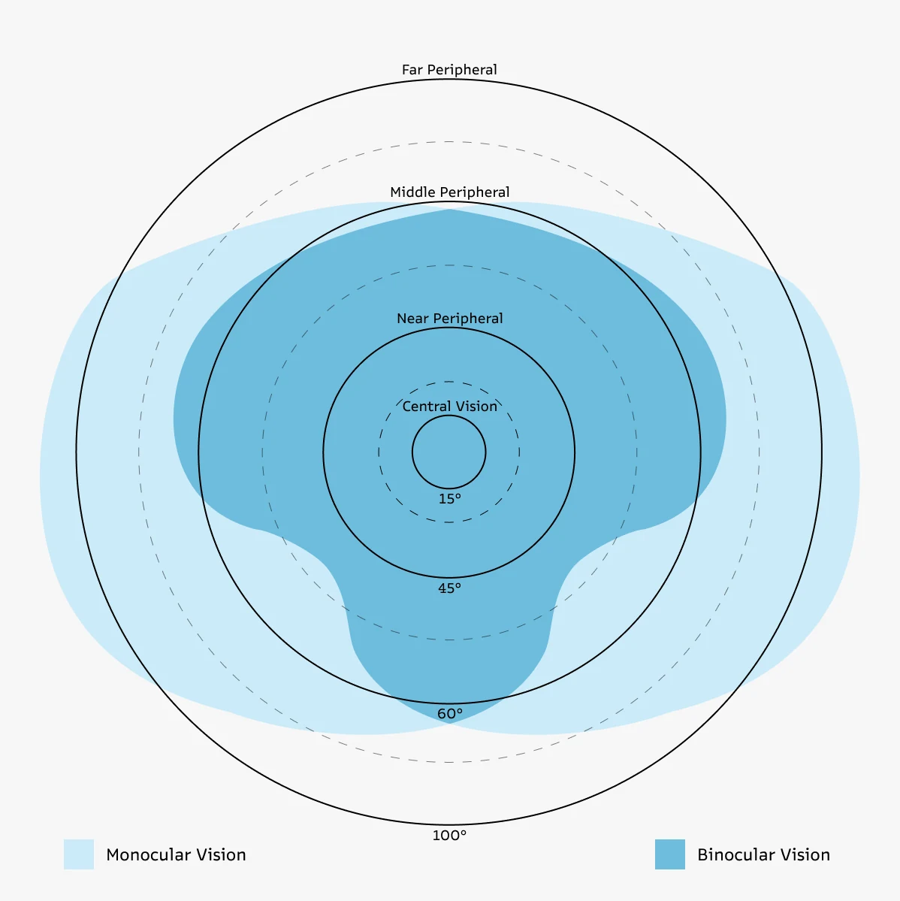
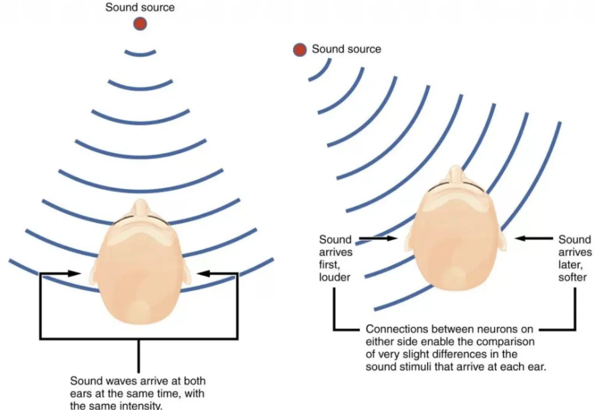
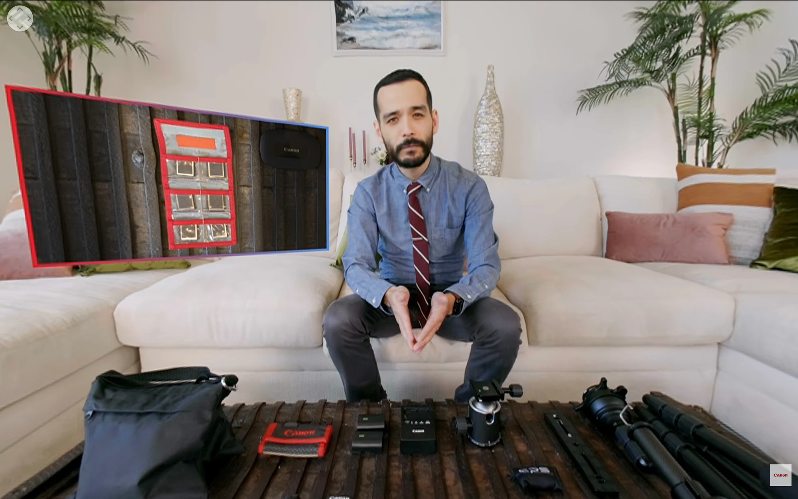

These guidelines distill key insights from my experiment, research, and user testing to help 2D animators create immersive experiences. Covering composition, camera movement, storytelling, and audio cues, they provide practical strategies to balance artistic expression with viewer comfort, making immersive animation accessible without the need for complex 3D tools.

> [!key]
> #### Key Takeaways
>
> - Prioritise viewer comfort over cinematic complexity
> - Keep motion minimal, predictable, and linear
> - Use centre-weighted composition
> - Guide attention through natural cues, not force
> - Reinforce storytelling with redundant signals

---

#### Center-Focused Composition

In immersive formats, the viewer (not the frame) controls the viewpoint. However, users naturally spend most of their time looking near the forward centre. 

#### Balanced Subject Placement

Avoid placing critical elements persistently at extreme edges or corners of the field of view. This forces continuous head rotation, which can lead to fatigue and discomfort.

#### Natural Eye Level & Horizon

#### Static Camera Preference

Keep the camera largely stationary. If movement is necessary, opt for slow dolly zooms without lateral shifts or rotations on the z-axis.

#### Design For Headset Constraints

Design with the limitations of common VR headset FOVs (90°–120°) in mind, considering that human vision spans roughly 180°-210° horizontally. This means peripheral content may not be visible.

#### Viewer Position Assumptions

Adjust the virtual camera's eye level based on whether the viewer is seated or standing. For most 180° videos you can assume the viewer is seated.

#### Diegetic Cues

)](image-4.webp)

Use elements like character gaze, gestures, motion, changes in lighting, and shadows to naturally guide the viewer's attention. Bear in mind that our peripheral vision is more sensitive to motion changes, so keep things static unless you want to shift attention.

#### Audio

Spatial audio increases immersion by aligning what the viewer hears with what they see, but unlike VR, where systems dynamically update audio with head movement, fixed media requires the artist to anticipate viewer orientation. This means using directional cues to guide attention and designing sound placement based on likely viewing behavior. 

While more advanced spatial techniques (like binaural audio) can deepen immersion, they also demand greater precision, audio must consistently match the visual scene to remain believable. 

#### Transitions

Use smooth transitions, consistent spatial logic and visual elements between scenes. Avoid abrupt changes in position or orientation, don’t cut from dark environment to a bright one suddenly and use flashing lights with care.

#### Redundancy In Storytelling

Incorporate subtle callbacks and overlapping cues so viewers don’t miss critical narrative moments even if they occasionally look away. This is crucial for 360° content.

#### Viewer Interaction

Decide if your narrative treats the viewer as an active participant (with acknowledged presence), implicit participant (acknowledged but not interactive) or as a passive observer (invisible presence). This decision influences staging, character behavior, and spatial design.

#### Creative Techniques

You can experiment with picture-in-picture or alternative viewports to offer varied perspectives without overwhelming the viewer.
