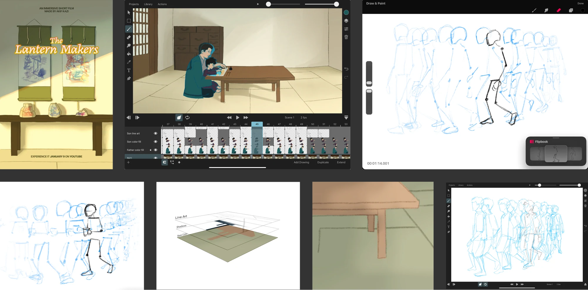
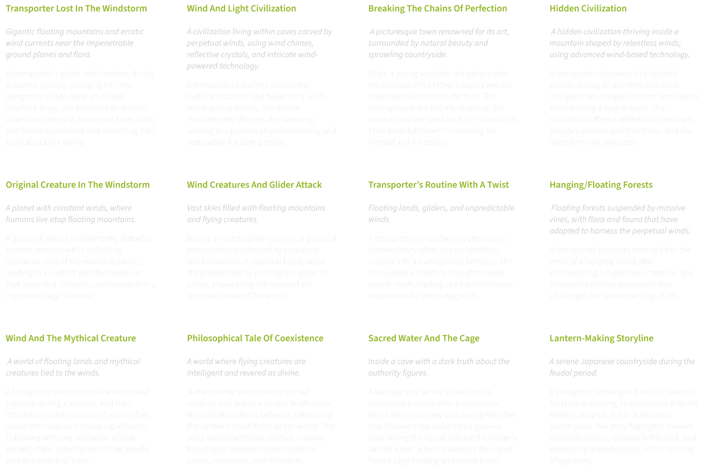
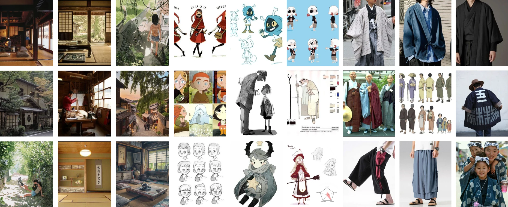
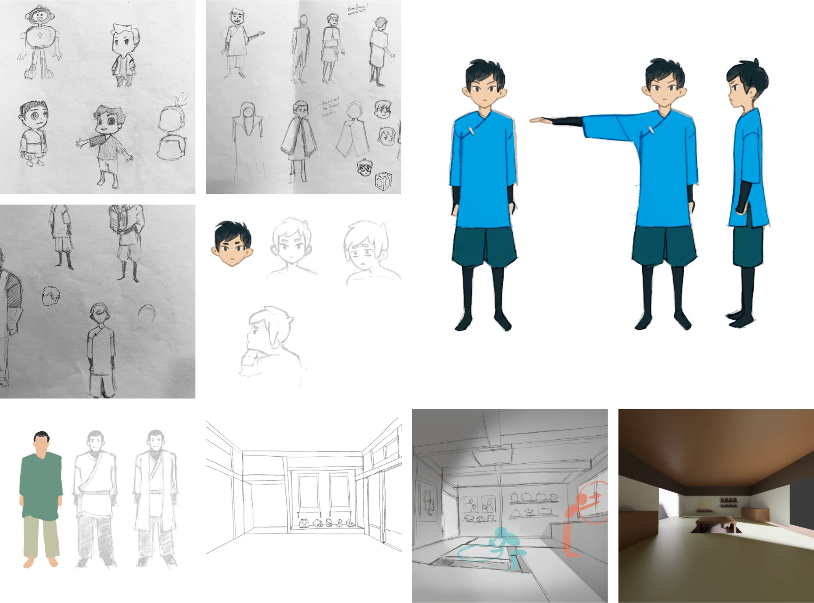
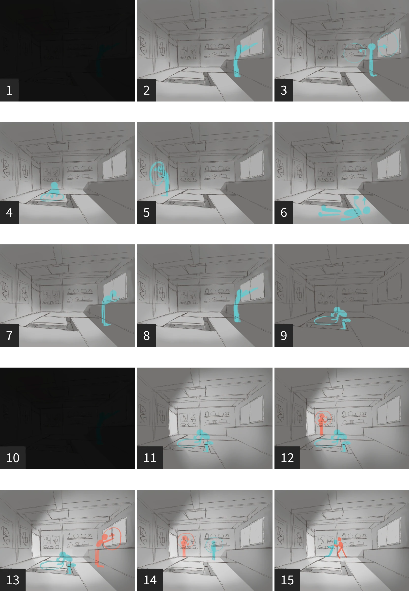
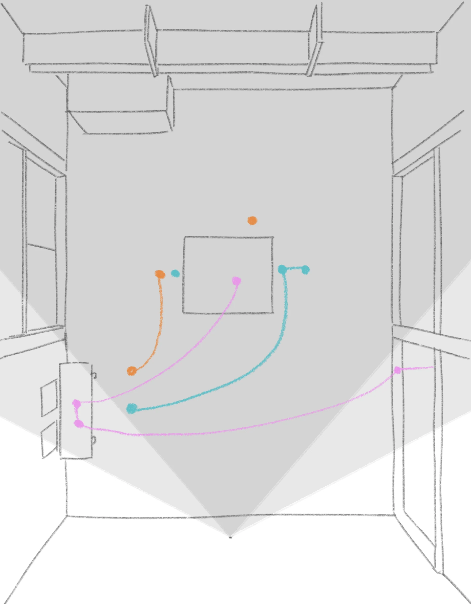
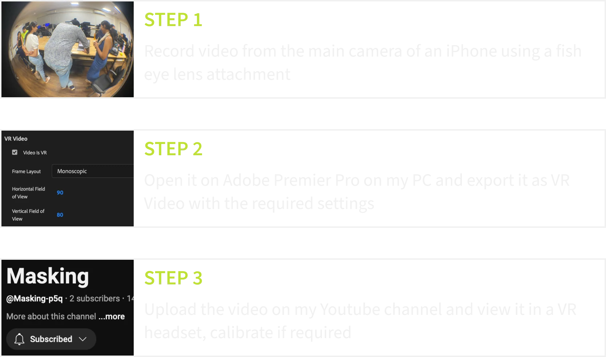
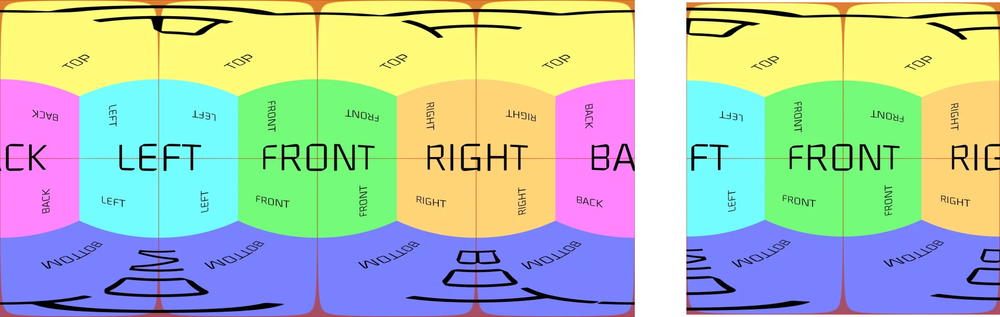
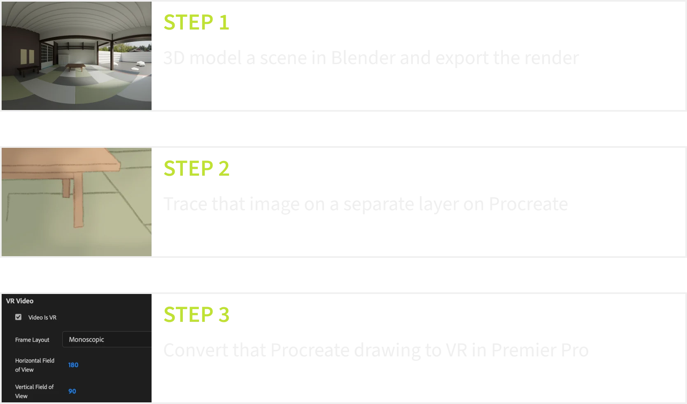

## Aims

#### Investigate

the feasibility and challenges of implementing 2D animation in immersive video environments.

#### Develop

a tailored workflow and guidelines for 2D animation hobbyists.

---

## Short Film

> A young boy, estranged from his passion for lantern-making, rediscovers it with his father’s support. Set in the Japanese countryside, the story explores themes of self-discovery, creative fulfillment, and embracing imperfections in this coming-of-age tale.
> 

---

## Inspiration/reference Board

---

## Sketches

---

## Storyboarding

---

## The Hard Part

](scene-1-20260403151215.mp4)

---

## Launch

 and was showcased at a college organized event attended by designers, peers, and guests](image-9.webp)

---

[Guidelines](guidelines/)

After assessing feasibility and challenges and validating my assumptions through a short film, I compiled key learnings into practical guidelines to help others build their own projects.

, its best experienced in a VR headset](akif-kazi-visual-design.webp)
